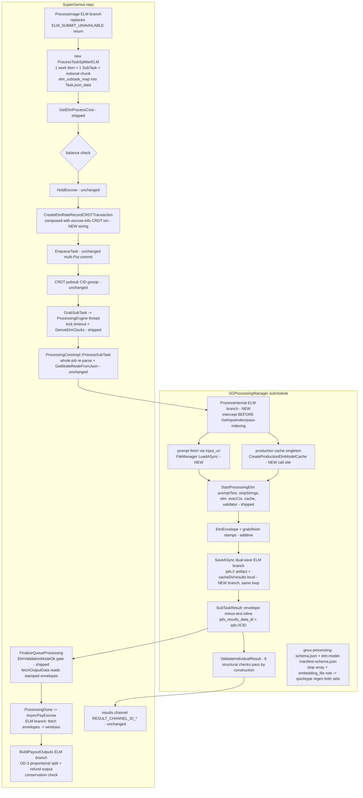

# Phase 4: Grid Integration & E2E Proof - Research

**Researched:** 2026-09-14
**Domain:** SuperGenius processing-grid integration of ELM jobs (splitter, submit wiring, worker routing, settlement, results convention, single-node E2E) spanning SuperGenius + SGProcessingManager (both `dev_elmruntime`)
**Confidence:** HIGH (nearly every claim verified by direct source inspection of the live tree at commit chain MNN `04855552` → thirdparty `1a0ad3e` → SGProcessingManager `7ffc911` → SuperGenius `d919363b1` → root `5de753f`; environment probed 2026-09-14)

## Summary

Phase 4 is integration, not invention. Phases 1–3 shipped every execution-layer component this phase consumes: the schema gates and deterministic cost (`GetElmProcessCost`), the three-clock derivation wired to `SetProcessingTimeout` (`processing_service.cpp:727-775`), the content-addressed cache with single-flight and pin RAII (`ElmModelCache`, production factory with zero callers awaiting this phase), and the complete processor (`StartProcessingElm` with stop strings, cancel, envelope). What's missing is exactly the grid plumbing: an ELM splitter producing 1:1 subtasks, the `ProcessImage` ELM submit branch, the worker-side routing from `ProcessSubTask` through `ProcessInternal` to `StartProcessingElm`, settlement stamps on the envelope plus the `BuildPayoutOutputs` ELM branch with refund, an always-artifact results convention feeding the existing `SaveASync` dual-save loop, two schema amendments (stop array; `embedding_file` role), and the empty-cache single-node E2E that is the milestone's acceptance criterion.

The three hardest integration facts the planner must design around: (1) **`ProcessInternal` is pass-indexed end-to-end** — it resolves `GetInputIndex`, indexes `passesVec[index]`, and reads `inputsVec[index]` before any processor runs; ELM jobs have no `passes`/`inputs`/`outputs`, so the ELM branch must intercept at the very top of `ProcessInternal` (or in `ProcessingCoreImpl` dispatch) and never fall into the pass-indexing path. (2) **The current `ProcessInternal` failure path converts processor error results into `PROCESSING_FAILED`** (`CANCELLED`/`TIMED_OUT`/`BUDGET_EXCEEDED` all `return outcome::failure`), which in `ProcessingEngine` routes to `m_processingErrorSink` WITHOUT `CompleteSubTask` — the subtask stays unprocessed and gets re-grabbed. The terminal-envelope requirement (overtime leg ends terminal, never silent re-grab) therefore requires the ELM branch to publish envelope-bearing error/cancelled results as **success-shaped `SubTaskResult`s** — the processor already sets `hash` + `output_buffers` + `chunkhashes` on error envelopes (`MakeErrorResult`), so the wrapper must not discard them. (3) **`BuildPayoutOutputs` is static and sees only the proto `TaskResult`** — settlement stamps live in envelope artifacts at `ipfs_results_data_id`. The payout path (`ProcessingDone` → `AsyncPayEscrow` → `PayEscrow` → `BuildPayoutOutputs`) must fetch envelopes (FileManager, the `fetchOutputData` fresh-ioc pattern) upstream of `BuildPayoutOutputs` and pass measured windows in — `GeniusNode::ProcessingDone` holds the task JSON (job-type sniff) and `genius_node` links `AsyncIOManager`, so this is additive plumbing, no proto change.

**Primary recommendation:** Land in submodule-first order — (a) schema amendments + quicktype regen (both generated sets), envelope stamps, `embedding_file` role; (b) `ProcessInternal` ELM branch + production-cache wiring + results convention in SGProcessingManager; (c) SuperGenius splitter + `ProcessImage` branch + rate-record composition + settlement branch after pointer bump; (d) E2E + regression gate + anti-scope audit. Respect the non-ELM parity invariant at every step (the ELM branch is additive; the existing path stays byte-identical).

<user_constraints>
## User Constraints (from CONTEXT.md)

### Locked Decisions

#### Schema Amendments (both STATE.md TODO escalations — closed here)
- **D-01:** **Amend `ElmGeneration` with a `stop` array NOW** — schema + quicktype regen (zero hand-edits to `generated/`) + validator bounds + the splitter/submit wiring passes it through to the `StartProcessingElm` `stopStrings` parameter. Requestor stop strings work end-to-end in v1.0. No parse-only stub (a silently-ignored field is exactly the set_config trap Pitfall 2 warns about)
- **D-02:** **Bound the stop array** — max 4 stop strings, each 1–128 chars UTF-8, no empty strings; reject-at-parse on violation, never clamp (Phase 1 D-05 discipline). OpenAI's max-4 convention
- **D-03:** **Add `embedding_file` as a 6th OPTIONAL manifest role** — NOT added to `kRequiredRoles` (embedding-less models unaffected); materialized at `embeddings_bf16.bin` (MNN DiskEmbedding default when `llm_config.json` has no `tie_embeddings`); schema pattern update + quicktype regen + `RoleFileName` entry + cache publishes it when declared. The Phase 3 test-side post-Acquire injection workaround retires

#### Settlement Stamps & Refund (FUND-03 build-out per 01-DESIGN-SETTLEMENT)
- **D-04:** **Stamps ride the `ElmEnvelope`** — add `grab_time_usec`/`finish_time_usec` as additive envelope fields; `ElmEnvelopeToJson` emits them. The stamps travel with the exact artifact the settlement reads via the existing `fetchOutputData` lambda in `FinalizeQueueProcessing` — one fetch, no second carriage mechanism. (Phase 3's envelope had exactly six keys; this is an additive, key-addition-compatible change)
- **D-05:** **The E2E proves the FULL refund mechanics** — escrow held = declared max; payout = sum of measured windows (proportional OD-3 split); refund output returns the remainder to the escrow source address; conservation check (Σoutputs == escrow_amount) holds. A short `max_output_tokens` ensures measured ≪ declared so the refund is non-trivially nonzero. Not unit-only, not conservation-only

#### Results Artifact Convention (RES-02, Pitfall 12)
- **D-06:** **Reuse the existing `SaveASync` dual-save loop** — the ELM execution path derives its output URL the way non-ELM jobs do (FileManager `cacheDir` + `/results/`) and feeds the existing loop (:1847-1965) via an ELM branch, NOT a parallel save path. `ipfs_results_data_id` carries the artifact location back exactly as today; the gossip results channel and IPFS artifact path stay unchanged
- **D-07:** **Always-artifact — no inline text, no 4KB threshold** — the inline `SubTaskResult` payload carries the envelope WITHOUT text (work_item_id, prompt/completion token counts, finish_reason, model_manifest_hash, stamps, artifact hash); the text lives ONLY in the content-addressed artifact. One convention, no size-dependent dual behavior, no boundary case

#### E2E Test Shape (E2E-01, the milestone acceptance criterion)
- **D-08:** **One GeniusNode (`is_processor=true`) plays both roles** — submit → gossip → grab → execute → publish → payout all on one node. The true single-node grid path; no two-node flake surface
- **D-09:** **Real `ipfs://` fixture transport** — the test publishes the staged fixture dir via FileManager to ipfs:// and the job JSON points at real URIs; the E2E exercises the REAL download path (empty cache → fetch → verify → generate). Not file:// shortcuts
- **D-10:** **2 work items on the SAME manifest** — proves the 1:1 splitter mapping, the `elm_subtask_map`, single-flight dedup (two subtasks, one download), and order-independence in a single run; the ~557MB model cost is paid once
- **D-11:** **Include the overtime leg** — a second E2E leg with tiny funding (e.g. `maximum_processing_hours` ≈ model-load time) drives a real deadline overrun → cancel → terminal envelope (`cancelled`/`BUDGET_EXCEEDED`) published → NOT re-grabbed. Pitfall 10's E2E verification leg ("overtime job ends terminal, not re-grabbed")

#### Carried Forward (locked by roadmap/prior phases — not re-decided here)
- Splitter mapping (Phase 1 design, `01-DESIGN-SUBTASK-MAPPING`): 1 work item → 1 subtask, one notional subtask-unique chunk, `elm_subtask_map` in task JSON, envelopes key on `subtaskid` + echo `work_item_id`, uniqueness inheritance across all three id domains
- Settlement design (Phase 1, `01-DESIGN-SETTLEMENT`): sum of per-subtask windows, milli-hour truncation at PRECISION=6, cap at escrow max, proportional split with deterministic tiebreak, malformed-entry filter, terminal envelopes ride the success-shaped path `ValidateIndividualResult` accepts
- Three-clock + lock wiring (Phase 1, shipped): `DeriveElmClocks` → `SetProcessingTimeout` before `CreateSubTaskQueue` (`processing_service.cpp:727-775`); per-subtask deadline from own grab
- Validation `none` (Phase 1, shipped): `ElmValidationModeOk` defensive gate at `FinalizeQueueProcessing`; E2E must run `validation: none` (Pitfall 2 — never enable redundant validation for text)
- Rate record (Phase 1, shipped): `CreateElmRateRecordCRDTTransaction` writes the sibling `elm_rate` key — Phase 4 wires the production call site
- Processor contract (Phase 3, shipped): `StartProcessingElm(chunkhashes, promptText, stopStrings, elm, execCtx, cache, capabilityValidator)`; base `StartProcessing` fail-closed; set_config-before-load; `LlmContext` count authority; pin RAII; split locks
- Scope discipline (D-004): no capability/inventory/cache advertising, no bidding/negotiation, no requester-side selection, no worker `/v1`, no proto changes, no SuperGenius-side aggregation
- Submodule commit discipline: innermost-first across the chain (SGProcessingManager → SuperGenius → root; MNN untouched this phase)
- Test infra: `SGPROC_TEST_DISCOVERY` gating, CTest `TIMEOUT` properties (×4 margin), wait-condition patterns (no sleep-based tests), `weak_from_this` in every new timer/callback

### Claude's Discretion
- The exact ELM-branch shape inside `ProcessImage` (how the `elm_subtask_map` is written into task JSON and how `elms[]` iterate into subtasks — follow the Phase 1 design's map placement verbatim)
- How `input_uri` prompt resolution integrates: whether prompt fetch happens in `ProcessInternal`'s ELM branch or a pre-step (the processor never fetches — `promptText` arrives resolved)
- The precise overtime-leg funding value and whether it lands in the same test binary or a separate target (CTest TIMEOUT budget governs)
- The production cache's construction site (where `CreateProductionElmModelCache` gets its single call — likely ProcessingManager or ProcessingCoreImpl initialization) and its lifetime
- Unit-test structure for the splitter, settlement branch, and results-convention legs
- How inline envelope-minus-text is serialized onto `SubTaskResult` fields (chunk_hashes/result_hash usage vs payout_metadata) — follow existing conventions the validation core accepts
- Backward-compat mechanics of the schema amendments (existing manifests without `embedding_file`, existing jobs without `stop`) — both are optional adds; the researcher verifies quicktype regeneration realities

### Deferred Ideas (OUT OF SCOPE)
None — discussion stayed within phase scope.
</user_constraints>

<phase_requirements>
## Phase Requirements

| ID | Description | Research Support |
|----|-------------|------------------|
| JOB-02 | Each ELM work item becomes exactly one subtask via a new ELM splitter (one notional chunk; `subtaskid↔work_item_id` map embedded in task JSON), leaving the existing chunk-based splitter untouched for non-ELM jobs | Splitter precedent verified (`processing_tasksplit.cpp:44-96`: UUID minting, `CHUNK_%d_%d` ids, one SubTask per SplitTask call); map placement design pinned (`01-DESIGN-SUBTASK-MAPPING` §3); quicktype `from_json` ignores unknown root keys (helper.hpp find-based reads) so `elm_subtask_map` rides Task.json_data safely; non-ELM parity invariant documented (SC-4/SC-5) |
| JOB-04 | Removed scope stays removed: no capability/inventory/cache advertising, bidding/negotiation, requester-side selection, claims/leases, worker-side `/v1` — in code or schema | Anti-Features table (FEATURES.md) is the audit baseline; grep-level + review-level audit design; scope discipline D-004 constraints enumerated |
| RES-02 | Results flow through the existing gossip results channel and IPFS artifact path unchanged; requestor reconstructs by aggregating envelopes by `work_item_id`; no SuperGenius-side aggregation | Results channel verified unchanged (`CompleteSubTask` → `RESULT_CHANNEL_ID_*` → `OnResultChannelMessage`); `SaveASync` dual-save loop verified (:1847-1965) with IPFSSaver `save_location = "ipfs://"+cid`; `ValidateResultData` requires ipfs:// lines (scheme gate the artifact URL must satisfy); ELM jobs lack `outputs[]` so the ELM branch must synthesize the output URL (cacheDir+/results/, D-06) |
| E2E-01 | Single node, empty cache, downloads Qwen-0.5B-class MNN causal-LM as billable job work, generates honoring settings and stop conditions, publishes work-item-tagged results | Fixture staged and hash-recorded (~557MB, 6 files + synthesized manifest); `CreateProductionElmModelCache` factory verified fail-closed on empty cacheDir (set via `setBitswap` at node startup `GeniusNode.cpp:1436-1437`); single-node both-roles topology precedent (`processing_multi_test` fixture, `is_processor=true`); stop-string carriage enabled by D-01 amendment |
| E2E-02 | Non-ELM jobs byte-identical before/after across splitter, funding, validation, results paths (regression gate) | Non-ELM baseline anchors verified: `ProcessImage` non-ELM loop, `GetProcessCost` byte path, `ValidateResults`/`ValidateIndividualResult`, `BuildPayoutOutputs` even-split; ELM branches are additive conditionals; parity gates already in Init (`hasAllLegacyFields` gate); regression test strategy documented |
| E2E-03 | New code ≥80% coverage; wait-condition tests (no sleeps); SuperGenius/GeniusSDK/GeniusWallet builds stay green | Test infra verified: `addtest` pattern + `/WHOLEARCHIVE:genius_node_test` linking, `wait_condition.hpp` testutil, `SGPROC_TEST_DISCOVERY` gating in SGProcessingManager tests, CTest TIMEOUT properties precedent; build dirs present (`SuperGenius/build/Windows/{Debug,Release}`); build-green strategy = additive changes + gated test targets |
</phase_requirements>

## Project Constraints (from project instructions)

From `SuperGenius/AgentDocs/CLAUDE.md` (RLP Development Guide — binding for SuperGenius-side edits):

- **Fix root cause, never hack around bugs** — no test-side workarounds for production bugs
- **Data-driven architecture** — no hard-coded operational facts in C++ source; schema/validator first, then behavior (the stop/embedding amendments follow exactly this order: schema → regen → gate → wiring)
- **C++17 only** — no C++20 features (`boost::coroutines` etc. excluded)
- **Wait-condition testing templates mandatory** — `NEVER use std::this_thread::sleep_for in tests`; ≥80% coverage on new code
- **Coding standards**: Ullman braces, Doxygen headers on public interfaces, all variables initialized, braces on all if/while/for
- **Minimal change philosophy**: surgical insertion; the ELM branches are additive conditionals beside existing paths, not rewrites
- **Build discipline**: cmake from `build/<Platform>/<BuildType>` only; user manages thirdparty builds separately
- **Commit discipline**: never commit unverified code; run tests/linter/build before committing

From workspace `AGENTS.md` (GSD project context): proto/API compatibility (no `SGProcessing.proto` changes — everything rides `Task.json_data`/`SubTask.json_data`), main-wallet key isolation N/A here (no wallet surface in this phase), Protocol Buffers for wire formats.

## Architectural Responsibility Map

| Capability | Primary Tier | Secondary Tier | Rationale |
|------------|-------------|----------------|-----------|
| Job-type sniffing (submit) | SuperGenius `GeniusNode::ProcessImage` | — | Exactly two call sites by design (splitter + cost); already sniffed for the interim rejection |
| ELM splitting + `elm_subtask_map` | SuperGenius `src/processing` (new `processing_tasksplit_elm.*`) | — | Sibling of chunk splitter; subtask creation is grid-side, not runtime-side |
| Escrow hold + rate record + enqueue | SuperGenius `GeniusNode` + `TransactionManager` | — | Funding is ledger-side; CRDT composition precedent exists |
| Worker dispatch | SuperGenius `ProcessingCoreImpl::ProcessSubTask` (unchanged shape) | SGProcessingManager `ProcessInternal` ELM branch | Core stays generic (JSON-shape routing); the ELM branch lives where the whole-job parse already exists |
| Prompt (`input_uri`) resolution | SGProcessingManager `ProcessInternal` ELM branch | FileManager/AsyncIOManager | Processor never fetches; wrapper resolves promptText before `StartProcessingElm` |
| Model fetch/verify/cache | SGProcessingManager `elmruntime` (shipped) | — | `CreateProductionElmModelCache` gets its call site here; zero behavior change |
| Generation execution | SGProcessingManager `processors` (shipped `StartProcessingElm`) | — | Consumed as-is; only stamp fields added to the envelope |
| Results artifact publish | SGProcessingManager `ProcessInternal` save loop (ELM branch) | FileManager `SaveASync` (ipfs + local dual save) | D-06: reuse, don't fork |
| Results validation | SuperGenius validation core (unchanged semantics) | `ElmValidationModeOk` gate (shipped) | Subtask-unique chunkids make cross-comparison structurally inert |
| Settlement/payout/refund | SuperGenius `TransactionManager::BuildPayoutOutputs`/`PayEscrow` ELM branch | `GeniusNode::ProcessingDone` (envelope fetch orchestration) | Ledger owns money movement; stamps fetched where task JSON is available |
| E2E test | SuperGenius `test/` (new target) | SGProcessingManager fixture | Single node both roles; consumes everything above |

## Standard Stack

### Core
| Library | Version | Purpose | Why Standard |
|---------|---------|---------|--------------|
| (no new dependencies — D-003 zero-new-deps holds) | — | — | Everything needed ships in the existing link set |

### Supporting (existing, verified in tree)
| Component | Location | Purpose | When to Use |
|-----------|----------|---------|-------------|
| `quicktype` | 23.2.6 installed globally (`quicktype --version` ✓) | Schema → C++ regen for both amendments | After every `gnus-processing-schema.json` / `elm-model-manifest-schema.json` edit |
| `ElmModelCache` | `SGProcessingManager/src/elmruntime/ElmModelCache.cpp` | Acquire/pin/single-flight/quarantine/LRU | Production factory wired this phase |
| `ElmProcessor::StartProcessingElm` | `src/processors/processing_processor_elm.cpp:100-140` | The execution unit | Called with resolved promptText + stopStrings + production cache |
| `DeriveElmClocks`/`ElmEscrowMinions` | `src/processing/processing_clocks_elm.{hpp,cpp}` | Three-clock + integer escrow path | Settlement branch reuses `ElmEscrowMinions` arithmetic conventions |
| `wait_condition.hpp` | `SuperGenius/test/testutil/` | Wait-condition test assertions | Every new test |
| Qwen fixture | `SGProcessingManager/test/fixtures/elm-test-model/` (~557MB, staged ✓) | Real-model E2E | Set `SGPROC_ELM_TEST_MODEL_DIR` per run; `GTEST_SKIP` when unset (existing convention) |

### Alternatives Considered
| Instead of | Could Use | Tradeoff |
|------------|-----------|----------|
| Envelope stamps for settlement windows | Proto field on SubTaskResult | BANNED (no proto changes); stamps-on-envelope is D-04 locked |
| Second save path for ELM results | Parallel artifact writer | Rejected by D-06 — reuse the existing dual-save loop |
| Inline text in SubTaskResult | 4KB threshold switch | Rejected by D-07 — always-artifact, one convention |

**Installation:** none — `npm`/`node`/`quicktype` already present (verified: node v24.16.0, npm 11.15.0, quicktype 23.2.6).

## Package Legitimacy Audit

No new external packages are installed or recommended by this phase (D-003: zero new dependencies). `quicktype` 23.2.6 is pre-installed and is the established pipeline (README.md + `.github/workflows/generate-headers.yml`), not a new adoption. **Packages removed/flagged: none — nothing to audit.**

## Architecture Patterns

### System Architecture Diagram (Phase 4 data flow — the seams this phase wires)



### Recommended Project Structure (deltas only)
```
SGProcessingManager/
├── gnus-processing-schema.json          # MODIFY: ElmGeneration.stop (D-01/D-02)
├── elm-model-manifest-schema.json       # MODIFY: role pattern += embedding_file (D-03)
├── generated/                           # REGENERATE (both sets; zero hand edits)
│   ├── ElmGeneration.hpp (+stop getter) # root set — elms reachable from root, single regen picks it up
│   └── elmruntime-manifest/             # second invocation, --top-level ElmModelManifest
├── include/elmruntime/ElmEnvelope.hpp   # MODIFY: grab_time_usec/finish_time_usec (D-04)
├── src/elmruntime/ElmManifest.cpp       # MODIFY: kRoleFilenames += embedding_file/embeddings_bf16.bin (NOT kRequiredRoles)
├── src/processingbase/ProcessingManager.cpp  # MODIFY: ProcessInternal ELM branch + cache site + save-loop ELM branch
└── test/                                # splitter-adjacent unit legs live SuperGenius-side; envelope/schema legs here
SuperGenius/
├── src/processing/
│   ├── processing_tasksplit_elm.cpp/.hpp    # NEW — sibling splitter
│   └── CMakeLists.txt                       # MODIFY: add source
├── src/account/
│   ├── GeniusNode.cpp                       # MODIFY: ProcessImage ELM branch + rate-record composition
│   └── TransactionManager.cpp/.hpp          # MODIFY: BuildPayoutOutputs/PayEscrow ELM branch (additive)
└── test/src/processing/ or test/src/account/
    └── elm_e2e_test.cpp (+ splitter/settlement unit tests)  # NEW — the acceptance-criterion E2E
```

### Pattern 1: ELM branch intercepts BEFORE pass-indexing in `ProcessInternal`
**What:** `ProcessInternal` resolves `GetInputIndex(model.get_source())` and indexes `passesVec[index]`/`inputsVec[index]` immediately (`ProcessingManager.cpp:1495-1533`); ELM jobs have no passes/inputs (schema-optional since Phase 1 D-04), so `GetInputIndex("input:<work_item_id>")` fails `MISSING_INPUT` before any ELM code could run.
**When to use:** the ELM branch is a top-of-function conditional: sniff `job_type == elm_processing` (the whole-job `processing_` member is already parsed), resolve the work item by scanning `elms[]` for the `ModelNode.source == "input:<work_item_id>"` match from `subTask.json_data`, then run the ELM pipeline and RETURN — never fall through to pass-indexing.
**Example:**
```cpp
// ProcessInternal, first statements (sketch — source: ProcessingManager.cpp:1489+ verified shape)
const auto jobTypeOpt = processing_.get_job_type();          // materialize by-value optional (UB rule)
if ( jobTypeOpt && jobTypeOpt.value() == sgns::JobType::ELM_PROCESSING )
{
    return ProcessElmWorkItem( ioc, chunkhashes, model, output_locations, execCtx );
}
// ... existing pass-indexed path, byte-identical ...
```

### Pattern 2: Terminal envelopes ride the SUCCESS-shaped path
**What:** today, `processResult.error` (any stage) makes `ProcessInternal` return `PROCESSING_FAILED` (`:1648-1668`); `ProcessingEngine`'s failure branch calls `m_processingErrorSink` WITHOUT `CompleteSubTask` → the subtask stays PROCESSING → lock expiry → re-grab (exactly Pitfall 10's loop).
**When to use:** the ELM wrapper must treat envelope-bearing error/cancelled results as publishable: `MakeErrorResult` and the cancelled path in the processor already set `result.hash`, `result.output_buffers` (the envelope JSON), and `chunkhashes` (`processing_processor_elm.cpp:44-76, 282-296`) — the wrapper checks envelope presence (hash non-empty + chunkhashes sized) and constructs the `SubTaskResult` anyway. `ValidateIndividualResult`'s six checks pass by construction (1 chunk : 1 hash, payout metadata set by `ProcessingCoreImpl`).
**Anti-pattern:** publishing a terminal envelope AND returning failure — the result is built but never reaches `CompleteSubTask`.

### Pattern 3: Map placement via unknown-key tolerance
**What:** `elm_subtask_map` is written into `Task.json_data` at split time as an extra root key. The quicktype-generated `from_json` reads only declared properties via `j.find(property)` (`generated/helper.hpp:141-202`) — unknown keys are ignored, so every existing re-parse (`ProcessingManager::Create`, `FinalizeQueueProcessing`, the lock-timeout derivation) tolerates the map without a schema change.
**When to use:** the splitter is the ONLY writer; the map is immutable after publish; readers parse it with plain `nlohmann::json` (never add it to the schema — it's transport metadata, not job schema).

### Pattern 4: Settlement windows fetched where the task JSON lives
**What:** `BuildPayoutOutputs` is static and sees only the proto `TaskResult`; stamps live in envelope artifacts. `GeniusNode::ProcessingDone` has `maybe_task` (task JSON → job-type sniff) and `genius_node` links `AsyncIOManager` (`CMakeLists.txt:88-136`) with `FileManager.hpp` already included in `GeniusNode.cpp:70`.
**When to use:** `ProcessingDone`'s ELM leg fetches each subtask result's envelope via the `fetchOutputData` pattern (fresh call-scoped `io_context`, `FileManager::LoadASync`, `"file"` saver-type mirroring `FinalizeQueueProcessing:379-411`), extracts `{subtaskid → window_millihours}`, and passes an optional settlement-data argument down `AsyncPayEscrow → PayEscrow → BuildPayoutOutputs` (additive defaulted parameter — source-compatible for the one existing caller at `GeniusNode.cpp:2973`).

### Pattern 5: Submodule-first landing + pointer bump
**What:** schema amendments + generated-set regen + ProcessInternal/cache/save-loop changes land in SGProcessingManager first; SuperGenius consumes after the pointer bump (`SuperGenius/.gitmodules` chain). Commits innermost-first: SGProcessingManager → SuperGenius → root (MNN untouched this phase; its fork patches already shipped in Phase 3).
**When to use:** every wave that touches both repos. Build order = commit order.

### Anti-Patterns to Avoid
- **Modifying `ProcessTaskSplitter::SplitTask` for ELM** — it is chunk-coupled (`numchunks` loop, `CHUNK_%d_%d`); ELM is a sibling (`01-DESIGN-SUBTASK-MAPPING` §2; ARCHITECTURE anti-pattern verified)
- **Hand-editing `generated/`** — both amendments ride the quicktype pipeline; the CI workflow (`generate-headers.yml`) regenerates on schema push
- **Enabling `addvalidationsubtask` for the E2E** — Pitfall 2; the E2E runs `validation: none` (the schema + `ElmValidationModeOk` refuse exact/redundant anyway — double gate)
- **Interpolating `work_item_id` into filesystem paths** — charset-gated `^[A-Za-z0-9_-]+$` at parse; cache keys are hex manifest hashes only
- **Global lock-timeout raise** — the per-job derivation is shipped; never touch the 15s default for non-ELM
- **A second results save path** — D-06 mandates the ELM branch FEEDS the existing loop

## Don't Hand-Roll

| Problem | Don't Build | Use Instead | Why |
|---------|-------------|-------------|-----|
| Model download/verify/cache | Custom fetch+verify | `ElmModelCache::Acquire` (shipped) | Single-flight, quarantine, pin RAII, LRU already tested |
| Generation loop | Custom tokenizer/decode | `StartProcessingElm` (shipped) | Settings, stop strings, cancel, counts, envelope all shipped |
| UUID/chunk-id minting | New generator | `generate_uuid_with_ipfs_id` (`processing_tasksplit.cpp:31-49`) | Same discipline → id-domain uniqueness inheritance |
| Escrow arithmetic | Float math | `ElmEscrowMinions` integer path (`llround` milli-hours → `*3/10` floor) | The design's exact deterministic semantics; shared with cost |
| Artifact publish | Custom IPFS write | `FileManager::SaveASync` dual-save loop | D-06; returns `ipfs://CID` in `save_location` (IPFSSaver.cpp:175-177) |
| Structured-result validation | Custom checks | `ValidateIndividualResult` (6 checks) | Terminal envelopes must pass it BY CONSTRUCTION |
| CRDT multi-key atomicity | Separate commits | Compose Puts into one `AtomicTransaction` before `EnqueueTask` commits | `TaskQueueImpl::EnqueueTask` accepts and extends an existing transaction (verified `TaskQueueImpl.cpp:32-67`) |

**Key insight:** every deceptively complex subsystem (cache, generation, validation, escrow) is shipped and tested — Phase 4's risk is exclusively in wiring and sequencing, which is why the parity invariant and the E2E dominate the plan.

## Common Pitfalls

### Pitfall P4-1: `ProcessInternal` pass-indexing rejects ELM before the branch runs
**What goes wrong:** adding the ELM routing "later" in `ProcessInternal` (after `GetCidForProc`, say) never executes — `GetInputIndex` fails first (`MISSING_INPUT`), because ELM jobs declare no `inputs[]`.
**How to avoid:** the ELM branch is the FIRST conditional in `ProcessInternal` (Pattern 1). Unit-test: an ELM job + a ModelNode `{"source":"input:w-1"}` subtask JSON routes to the ELM path (observable via the production cache being consulted / a prompt fetch attempted), never `MISSING_INPUT`.
**Warning signs:** E2E worker logs showing `MISSING_INPUT` for a valid ELM subtask.

### Pitfall P4-2: Error/cancelled envelopes silently dropped → re-grab loop
**What goes wrong:** the shipped failure mapping (`CANCELLED`/`TIMED_OUT`/`BUDGET_EXCEEDED` → `PROCESSING_FAILED` return) discards the processor's error envelope; `CompleteSubTask` never runs; the overtime leg loops (Pitfall 10's exact scenario).
**How to avoid:** Pattern 2 — the ELM wrapper publishes envelope-bearing results regardless of `processResult.error`. The E2E's overtime leg (D-11) is precisely this pitfall's verification: terminal envelope published, queue drained, no second `[GRABBED]` for the subtaskid.
**Warning signs:** repeated `[GRABBED]` for one subtaskid; `Recovered expired-locked task` lines during the overtime leg.

### Pitfall P4-3: Settlement can't see stamps (proto-only view)
**What goes wrong:** implementing the `BuildPayoutOutputs` ELM branch against `SubTaskResult` fields only — stamps aren't there; the branch either crashes, pays even-split (wrong), or pays full escrow (no refund — the "Looks Done But Isn't" funding checkbox).
**How to avoid:** Pattern 4 — fetch envelopes at `ProcessingDone`/`PayEscrow` via the fresh-ioc `FileManager` pattern; pass windows explicitly. Design doc `01-DESIGN-SETTLEMENT` §2 arithmetic is the contract (milli-hour `llround`, `*3/10` floor, cap at escrow max, remainder to largest-window with lexicographic-subtaskid tiebreak).
**Warning signs:** E2E refund leg asserting conservation but never checking refund ≠ 0.

### Pitfall P4-4: The save loop's `outputs[]` guard skips ELM results
**What goes wrong:** the existing save loop runs only `if (processResult.output_buffers && !outputs.empty())` (`:1855`) — ELM jobs have no `outputs[]`, so the envelope never saves, `ipfs_results_data_id` stays empty, `ValidateResultData` passes vacuously but the artifact (and stamps) never exist.
**How to avoid:** D-06's ELM branch synthesizes the output URL (FileManager `cacheDir` + `/results/`, ipfs:// prefix for the dual-save) and runs the same `SaveASync` mechanics; assert in tests that `ipfs_results_data_id` is a non-empty `ipfs://` line (the scheme gate at `ValidateResultData:638-672` enforces it downstream anyway).
**Warning signs:** E2E subtask completes with empty `ipfs_results_data_id`.

### Pitfall P4-5: quicktype drops the stop-array bounds
**What goes wrong:** relying on schema `maxItems: 4` / `minLength`/`maxLength` for `stop` — quicktype codegen drops them (established repo fact: minItems, exclusiveMinimum, and number bounds on optionals all dropped; gates live in `CheckElmValidity`).
**How to avoid:** D-02 discipline — bounds (≤4 entries, each 1–128 UTF-8 bytes, no empty) enforced in the `CheckElmValidity` generation-settings loop, reject-at-parse (`ELM_GENERATION_SETTINGS_INVALID`), never clamp. Mirror the existing per-field gate style (`ProcessingManager.cpp:704-746`).
**Warning signs:** a 5-entry stop array parsing cleanly.

### Pitfall P4-6: Cross-generated-set TU mixing (the D-P3-2 rule)
**What goes wrong:** new settlement/routing code in one TU including BOTH the root `generated/` set and `generated/elmruntime-manifest/` — `ClassMemberConstraints`/`ElmType` redefinition, hard compile error.
**How to avoid:** the root set only (`sgns::Elm` etc.) for splitter/routing/settlement code; manifest-set access stays behind the `ElmEntryPreflight` plain-value bridge. The `embedding_file` regen touches ONLY the manifest set files.
**Warning signs:** redefinition errors mentioning `ClassMemberConstraints`.

### Pitfall P4-7: Production cache constructed before FileManager is wired
**What goes wrong:** calling `CreateProductionElmModelCache` at static/init time before `FileManager::setBitswap` ran — `getCacheDir()` empty → `CACHE_DIR_UNSET` fail-closed (by design, `ElmModelCache.cpp:295-316`).
**How to avoid:** construct lazily at first ELM subtask (node startup wires `InitializeSingletons` + `setBitswap` at `GeniusNode.cpp:1436-1437`); cache the `shared_ptr` result; map construction failure to a terminal error envelope (Pattern 2), not a crash.
**Warning signs:** `CACHE_DIR_UNSET` in E2E logs after node startup completed.

### Pitfall P4-8: Deadline never wired for ELM (only the lock timeout is)
**What goes wrong:** assuming the shipped three-clock wiring covers cancellation — `processing_service.cpp:727-775` only sets the queue LOCK timeout. The execCtx deadline flows from `pass.per_pass_deadline_ms` (`ProcessInternal:1540-1543`), which ELM jobs don't have → `deadlineMs == 0` → the deadline timer never arms → the overtime leg never cancels, it just runs to completion (or hangs until lock expiry → re-grab).
**How to avoid:** the ELM branch sets `execCtx.deadlineMs` itself from the funding block (`DeriveElmClocks(hours).deadline`, per-subtask from own grab — the design's rule), BEFORE the timer-arm point; the cancel token → `ElmStopStringStreamBuf` external poll → `Llm::cancel()` chain is shipped.
**Warning signs:** overtime leg completing "successfully" with `finish_reason=max_tokens` instead of `cancelled`.

### Pitfall P4-9: Rate-record transaction not atomic with escrow/task write
**What goes wrong:** calling `CreateElmRateRecordCRDTTransaction` as a SECOND standalone transaction — it commits `escrow_path/elm_rate` separately from the escrow-info/task Puts; a crash between them orphans the rate record (settlement dispute surface, OD-2's whole point).
**How to avoid:** compose into ONE transaction: `CreateEscrowInfoCRDTTransaction` returns a `crdt_transaction`; add the `elm_rate` Put to THAT object (either extend the rate-record helper to accept an existing transaction, or inline the Put — the helper's own comment prescribes "the same CRDT transaction … multi-Put atomic transaction precedent: TaskQueueImpl.cpp:32-67"). `EnqueueTask` then adds task/subtask/claimable Puts and commits once.
**Warning signs:** two CRDT commits in logs for one ELM submit.

### Pitfall P4-10: Windows E2E flakiness (CTest/gating/timeouts)
**What goes wrong:** ungated test targets re-break the SuperGenius parent build (Pitfall 15.3); fixed CTest timeouts cut off model load+generation; sleep-based polling flakes.
**How to avoid:** `SGPROC_TEST_DISCOVERY`-gated discovery + `set_tests_properties(... PROPERTIES TIMEOUT N)` with ×4 margin over observed runtime (Phase 3's fixture legs run minutes with the ~557MB model — budget the E2E generously, e.g. TIMEOUT ≥ 1800s and verify observed ×4); `wait_condition.hpp` polling only; teardown joins/detaches generation threads deliberately.
**Warning signs:** CI timeouts at exactly the TIMEOUT value; `child_registration_test`-style teardown segfaults in new tests.

## Code Examples

### The ELM submit branch (ProcessImage — replacing the interim rejection)
```cpp
// Source: verified shapes from GeniusNode.cpp:2258-2387 (interim block replaced), 
// processing_tasksplit.cpp (minting), 01-DESIGN-SUBTASK-MAPPING §2-3
const auto jobTypeOpt = procmgr->GetProcessingData().get_job_type(); // by-value optional (UB rule)
if ( jobTypeOpt && jobTypeOpt.value() == sgns::JobType::ELM_PROCESSING )
{
    auto funds = GetElmProcessCost( *procmgr );            // shipped
    if ( funds <= 0 ) { return outcome::failure( Error::PROCESS_COST_ERROR ); }
    if ( account_->GetUTXOManager().GetBalance() < funds )
    { return outcome::failure( Error::INSUFFICIENT_FUNDS ); }
    // ... task uuid + json_data exactly as the non-ELM path builds it ...
    processing::ProcessTaskSplitterELM elmSplitter;
    std::list<SGProcessing::SubTask> subTasks;
    elmSplitter.SplitTask( task, subTasks, /*elms[]*/ ..., pubsub_->GetHost()->getId().toBase58() );
    // Splitter writes "elm_subtask_map":[{work_item_id, subtaskid},...] into task json_data
    // ... HoldEscrow -> compose elm_rate Put INTO the escrow-info CRDT transaction -> EnqueueTask ...
}
else
{
    /* existing chunk-based path, byte-identical (SC-4) */
}
```

### The splitter's notional chunk (1:1 mapping)
```cpp
// Source: processing_tasksplit.cpp:64-77 id/format discipline + 01-DESIGN-SUBTASK-MAPPING §2
SGProcessing::SubTask subtask;
subtask.set_ipfsblock( task.ipfs_block_id() );
subtask.set_json_data( modelNodeJson.dump( -1 ) );   // ModelNode{ "source": "input:<work_item_id>" }
subtask.set_subtaskid( generate_uuid_with_ipfs_id( ipfsid ) );
SGProcessing::ProcessingChunk chunk;
chunk.set_chunkid( ( boost::format( "CHUNK_%d_%d" ) % uuidstring % 0 ).str() ); // subtask-unique
chunk.set_n_subchunks( 1 );
subtask.add_chunkstoprocess()->CopyFrom( chunk );    // exactly ONE — 1:1 with the result's single hash
```

### Terminal-envelope publication check (wrapper side)
```cpp
// Source: processing_processor_elm.cpp:44-76 (MakeErrorResult sets hash+buffers+chunkhashes)
//         ProcessInternal:1648-1668 (the failure mapping to bypass for envelopes)
if ( processResult.error && !processResult.hash.empty()
     && chunkhashes.size() == /* notional chunk count */ 1 )
{
    // Envelope-bearing terminal result: publish as success-shaped SubTaskResult
    // (ValidateIndividualResult passes; queue drains; no re-grab).
}
```

### Settlement arithmetic (the design's contract, verbatim)
```text
// Source: 01-DESIGN-SETTLEMENT §2 (authoritative) + processing_clocks_elm.hpp (shared integer path)
window_i_ms         = finish_time_usec_i - grab_time_usec_i        (clamped >= 0)
window_millihours   = llround(window_i_ms / 3600000.0 * 1000.0)
billable_millihours = Σ_i window_millihours_i
billable_minions    = billable_millihours * 3 / 10                 (integer floor)
billable_minions    = min(billable_minions, escrow_max_minions)    (cap)
share_i             = billable_minions * window_millihours_i / billable_millihours  (uint128 floor)
                       remainder → largest-window items, tiebreak lexicographic subtaskid
refund_output       = escrow_max_minions - billable_minions  →  escrow_tx->GetSrcAddress()
conservation        : Σ(outputs) == escrow_amount               (uint128; refund makes it hold)
```

## State of the Art

| Old Approach | Current Approach | When Changed | Impact |
|--------------|------------------|--------------|--------|
| Interim `ELM_SUBMIT_UNAVAILABLE` early return | Full ELM submit branch (this phase) | Phase 4 | The `:2266-2284` block is deleted, replaced by split→escrow→enqueue |
| Six-key envelope | Eight-key envelope (+stamps) | D-04 | Additive; `ElmEnvelopeToJson` gains two numeric keys |
| Five-role manifest set | Six roles (+`embedding_file`) | D-03 | Optional; `kRequiredRoles` untouched; Phase 3's post-Acquire injection retires |
| Even-split payout for all jobs | ELM proportional-by-window + refund | OD-3/D-05 | Non-ELM even-split branch untouched |
| Pitfall 12's "4KB inline cap" | Always-artifact (D-07) | CONTEXT supersedes | Simpler; one convention |

**Deprecated/outdated:** none in shipped code — all deprecations were retired in Phases 2–3 (temp-dir materializer gone, MNN_Llm shim retired).

## Assumptions Log

| # | Claim | Section | Risk if Wrong |
|---|-------|---------|---------------|
| A1 | `AsyncPayEscrow`/`PayEscrow`/`BuildPayoutOutputs` signature extensions with additive defaulted params are source-compatible for ALL callers (only `GeniusNode.cpp:2973` found in SuperGenius; GeniusSDK/GeniusWallet usage not exhaustively grepped) | Settlement (Pattern 4) | LOW — defaulted params are source-compatible; a wrapper overload avoids it entirely if needed |
| A2 | The E2E overtime leg can rely on wall-clock overrun (tiny `maximum_processing_hours` → derived deadline ≈ seconds → cancel before generation completes); exact funding value is planner/discretion (D-11 leaves it open) | E2E design | LOW — leg shape locked; only the constant is open |
| A3 | `ProcessingCoreImpl::ProcessSubTask` needs NO change (dispatch stays generic; the ModelNode JSON does the routing) per ARCHITECTURE integration point #4 — but the ELM `ModelNode` source string (`input:<work_item_id>`) must survive `GetModelNodeFromJson` parse (plain `sgns::ModelNode` from_json — `source` is a free string, verified) | Worker routing | LOW — if `ModelNode` constraints reject the string, the subtask JSON shape is planner-discretion (any JSON the ELM branch can parse back) |
| A4 | Quicktype regen of the root set for `stop` produces `boost::optional<std::vector<std::string>> get_stop()` (array-of-string on an optional parent) — exact getter shape unverified until regen runs (consistent with `tags` precedent in `SgnsProcessing.hpp:63`) | Schema amendment | LOW — shape follows the established vector-of-string pattern |
| A5 | Single-node both-roles E2E needs no second node's gossip round-trip for results delivery (the node receives its own results-channel publication) — the multi-test fixture implies self-delivery, but self-subscription behavior on the exact channel implementation is runtime-verified only in the non-ELM path | E2E design | MEDIUM — if self-delivery doesn't occur, the E2E polls `GetTaskResult`/queue state instead (wait-condition, still single-node); flag for early E2E spike |

## Open Questions (RESOLVED)

All three questions are resolved at plan level; dispositions below are binding for executors.

1. **Stamp capture mechanics inside the processor seam** — RESOLVED → 04-02 Task 2 (c): additive `execCtx` field set by the ELM branch before prompt fetch
   - What we know: D-04 locks stamps onto the envelope; the design table says grab = before ANY fetch (incl. model download), finish = envelope assembly. `ProcessInternal` already captures `startTimeUsec`/`endTimeUsec` around `StartProcessing` (`:1622-1636`).
   - What was unclear: whether grab is stamped by the wrapper (passed in via an additive `ExecutionContext` field — prompt fetch then included) or by the processor at its own entry (prompt fetch excluded, model download included).
   - Resolution (adopted by 04-02): additive `execCtx` field set by the ELM branch before prompt fetch (matches the design's "before any fetch" exactly, zero signature change to the shipped `StartProcessingElm`).
2. **Inline envelope-minus-text serialization target** — RESOLVED → 04-02 Task 3 (c)/(d): two-distinct-digest convention per the recommendation below, verbatim
   - What we know: `SubTaskResult` has `result_hash`, `chunk_hashes`, `ipfs_results_data_id` (+ payout fields); CONTEXT leaves field choice to discretion following validation-core conventions.
   - Resolution (adopted by 04-02): `result_hash` = sha256(envelope-minus-text JSON); the single `chunk_hashes[0]` = sha256(full envelope JSON) (the processor's existing resultHash of the full envelope — reused verbatim); `ipfs_results_data_id` = artifact CID. Two DISTINCT digests — the plans assert `result_hash ≠ chunk_hashes[0]` for text-bearing envelopes. This keeps `ValidateIndividualResult` untouched and gives the requestor two deterministic digests. Residual deviation from D-07's literal inline fields (no arbitrary-payload `SubTaskResult` field exists and proto changes are out of scope) is documented in 04-02 Task 3 (d) and its SUMMARY for user ratification.
3. **Overtime-leg test placement** — RESOLVED → 04-05 Task 2 Leg 2: separate CTest CASE in the same binary, warm cache
   - What we know: same binary vs separate target is discretionary; CTest TIMEOUT budget governs; the ~557MB model download makes the empty-cache leg the long pole.
   - Resolution (adopted by 04-05): separate CTest test CASE in the same binary, with the model already cached by the first leg (the overtime leg doesn't need an empty cache — it needs a short deadline), keeping total wall-clock bounded by one model download.

## Environment Availability

| Dependency | Required By | Available | Version | Fallback |
|------------|------------|-----------|---------|----------|
| Node.js / npm | quicktype regen | ✓ | v24.16.0 / 11.15.0 | — |
| quicktype | schema → generated/ regen (both sets) | ✓ | 23.2.6 (global) | CI workflow regenerates on push (`generate-headers.yml`) |
| Qwen fixture (~557MB, 6 files) | E2E + real-model legs | ✓ staged (`test/fixtures/elm-test-model/`, hashes match README table) | Qwen2.5-0.5B-Instruct-MNN | `GTEST_SKIP` convention when `SGPROC_ELM_TEST_MODEL_DIR` unset |
| `SGPROC_ELM_TEST_MODEL_DIR` | fixture legs | ✗ (not set in shell env) | — | Tests set per-invocation (existing convention); set before CTest runs |
| SuperGenius build tree | compile + run tests | ✓ `build/Windows/Debug` + `Release` | — | — |
| SGProcessingManager standalone build | submodule tests + regen verification | ✓ (build tlogs present, `build/Windows/Release`) | — | — |
| Branches | all work | ✓ `dev_elmruntime` both repos (verified `git branch --show-current`) | — | — |
| MNN fork patches (seed + cancel) | ELM execution | ✓ shipped Phase 3 (`SGPROC_MNN_LLM_FORK_PATCHES` detection in CMake) | degraded no-op path exists but NOT acceptable for E2E | — |
| CMake/MSVC toolchain | builds | ✓ (existing build trees configured) | VS 2022 | — |

**Missing dependencies with no fallback:** none.
**Missing dependencies with fallback:** `SGPROC_ELM_TEST_MODEL_DIR` shell-env unset — tests self-skip unless set; the plan's execution steps must export it before running the E2E.

## Security Domain

**ASVS level 1, block-on: high** (`config.json: workflow.security_enforcement: true`).

### Applicable ASVS Categories

| ASVS Category | Applies | Standard Control |
|---------------|---------|-----------------|
| V2 Authentication | no | No new auth surface (node identity/payout addresses flow through existing escrow machinery) |
| V3 Session Management | no | No sessions; subtask locks are the existing mechanism |
| V4 Access Control | yes (indirect) | Cache-blind assignment preserved (anti-scope); no new privileged paths; worker-attested stamps capped by escrow max (accepted residual T-01-10) |
| V5 Input Validation | yes | Schema gates + `CheckElmValidity` C++ bounds (stop array ≤4×1–128B, no empties — D-02; work_item_id charset `^[A-Za-z0-9_-]+$`); manifest size/artifact ceilings (`kMaxManifestBytes` 1MB, `kMaxArtifacts` 32, shipped); `elm_subtask_map` parsed as data, never interpolated into paths |
| V6 Cryptography | no (new) | sha256 verification shipped (Phase 2, fail-closed, no debug bypass); no new crypto hand-rolled |

### Known Threat Patterns for this integration

| Pattern | STRIDE | Standard Mitigation |
|---------|--------|---------------------|
| Path traversal via `work_item_id` in filenames | Tampering/Elevation | Charset gate at parse; cache keys = hex manifest hashes only; output filenames derived from gated ids (shipped convention) |
| Unverified model execution | Tampering | Fail-closed manifest+artifact sha256 (shipped); smoke check pre-publish; no bypass added this phase |
| Settlement stamp forgery (worker over-reporting) | Tampering | Capped at escrow max by construction (§2 cap); under-reporting hurts only the worker; v1.0 single-node accepted residual (T-01-10), multi-node attestation deferred |
| TOCTOU cache swap | Tampering | Atomic rename publish + quarantine (shipped); optional re-verify stays optional |
| Poisoned results channel | Tampering | `ValidateIndividualResult` six structural checks + `ValidateResultData` ipfs:// scheme gate (unchanged, terminal envelopes pass by construction) |
| DoS via malformed job/subtask JSON | DoS | Parse gates (`Init` parity gate, `CheckElmValidity`, `FinalizeQueueProcessing` try/catch — all shipped); new `elm_subtask_map` readers must parse defensively (plain nlohmann try/catch, same idiom) |

### Anti-Scope Audit checklist (SC-5, JOB-04)
Grep + review level, against FEATURES.md Anti-Features: no `bidding`/`negotiation` symbols; no capability/inventory/cache advertisement messages; no requester-side selection logic; no claims/leases beyond existing subtask locks; no `/v1` HTTP surface; no `SGProcessing.proto` diff; no SuperGenius-side aggregation (requestor joins `subtaskid → work_item_id` via the map — SuperGenius only tags).

## Runtime State Inventory

> Phase type: new-feature integration (not rename/refactor/migration) — section omitted per protocol.

## Validation Architecture

> `workflow.nyquist_validation: false` in `.planning/config.json` — section skipped per protocol. Test-infra facts the planner still needs are embedded in Pitfall P4-10 and E2E-03 support above.

## Sources

### Primary (HIGH confidence — direct workspace source inspection, 2026-09-14)
- `SuperGenius/src/account/GeniusNode.cpp:2258-2387` (ProcessImage + interim ELM block + GetProcessCost/GetElmProcessCost), `:2900-3010` (ProcessingDone → AsyncPayEscrow), `:3267+` (CreateElmRateRecordCRDTTransaction + Phase-4 wiring comment), `:1436-1437` (FileManager setBitswap at startup)
- `SuperGenius/src/account/TransactionManager.cpp:1073-1277` (HoldEscrow, BuildPayoutOutputs even-split + conservation, PayEscrow, AsyncPayEscrow), `TransactionManager.hpp:75-149` (burn defaults)
- `SuperGenius/src/processing/processing_tasksplit.cpp:31-96` (UUID minting, chunk-id format, SplitTask shape)
- `SuperGenius/src/processing/processing_clocks_elm.hpp` (constants, ElmClocks, ElmEscrowMinions contract), `processing_service.cpp:727-775` (lock-timeout wiring — lock ONLY, not execCtx deadline)
- `SuperGenius/src/processing/impl/processing_core_impl.cpp:67-170` (ProcessSubTask dispatch — unchanged shape), `impl/TaskQueueImpl.cpp:32-67` (multi-Put atomic commit precedent)
- `SuperGenius/src/processing/processing_subtask_queue_accessor_impl.cpp:272-460` (OnResultReceived, FinalizeQueueProcessing, ElmValidationModeOk, fetchOutputData fresh-ioc pattern), `:635-720` (ValidateResultData ipfs:// scheme gate), `processing_subtask_queue.cpp:150-230` (UnlockExpiredItems — the re-grab mechanism), `processing_engine.cpp:60-160` (per-subtask thread, CompleteSubTask vs error-sink asymmetry)
- `SuperGenius/src/processing/processing_validation_core.cpp:40-330` (ValidateResults cross-comparison, ValidateIndividualResult six checks, AttemptToleranceFallback)
- `SuperGenius/src/processing/proto/SGProcessing.proto:9-115` (Task/SubTask/SubTaskResult/ProcessingChunk field set — no free-text field)
- `SuperGenius/src/processing/CMakeLists.txt` + `src/account/CMakeLists.txt:68-148` (link sets: processing_service ↔ ProcessingBase/MNN/AsyncIOManager; genius_node PRIVATE AsyncIOManager)
- `SGProcessingManager/gnus-processing-schema.json:76-160` (elms/Elm/ElmGeneration/ElmFunding — the D-01 site), `:160-260` (ElmModelArtifact/ElmModelManifest/ElmModelRuntime — the D-03 shape docs), `elm-model-manifest-schema.json` (the D-03 GENERATION source — second quicktype invocation)
- `SGProcessingManager/src/processingbase/ProcessingManager.cpp:419-480` (factory registration incl. ElmProcessor), `:560-620` (Init parity gate), `:590-750` (CheckElmValidity gates + GetElmMaximumProcessingHours), `:1489-1668` (ProcessInternal: pass-indexing, budgets, deadline timer, FAILURE mapping), `:1847-1965` (save loop + outputs[] guard + dual-save), `:1990-2185` (GetCidForProc/GetSubCidForProc fetch idiom), `:2321-2340` (GetModelNodeFromJson)
- `SGProcessingManager/src/elmruntime/ElmManifest.cpp:36-50` (kRoleFilenames/kRequiredRoles — D-03 site), `:120-280` (verify-before-parse, role gates, RoleFileName), `ElmModelCache.cpp:240-380` (startup scan, CreateProductionElmModelCache fail-closed, Acquire single-flight), `ElmEnvelope.{hpp,cpp}` (six-key envelope + ElmEnvelopeToJson — D-04 site)
- `SGProcessingManager/src/processors/processing_processor_elm.cpp:44-76` (MakeErrorResult sets hash+buffers+chunkhashes — Pattern 2 basis), `:100-480` (StartProcessingElm full contract), `src/processors/CMakeLists.txt:30-70` (SGPROC_HAS_MNN_LLM + fork-patch detection)
- `SGProcessingManager/generated/ElmGeneration.hpp` (current four-field shape), `generated/helper.hpp:141-202` (find-based reads → unknown-key tolerance), `generated/elmruntime-manifest/ElmModelManifest.hpp` (fallback set), `README.md` + `.github/workflows/generate-headers.yml` (regen commands)
- `SGProcessingManager/test/fixtures/README.md` (fixture provenance, staging, embedding-gap escalation), `test/*/CMakeLists.txt` (SGPROC_TEST_DISCOVERY + TIMEOUT patterns)
- `SuperGenius/test/src/account/elm_cost_clocks_test.cpp` (node fixture + ELM job JSON builder + flip-to-acceptance precedent), `test/src/processing_multi/processing_multi_test.cpp` (multi-node fixture topology, is_processor config, MintTokens/PostJobs idioms), `test/src/{account,processing_multi}/CMakeLists.txt` (addtest + WHOLEARCHIVE linking)
- `thirdparty/AsyncIOManager/src/FileManager.cpp:106-160` (SaveASync prefix dispatch), `src/IPFSSaver.cpp:175-177` (`save_location = "ipfs://" + cid`)
- Workstream research: `.planning/workstreams/elmbridge/research/{PITFALLS,ARCHITECTURE,FEATURES,STACK}.md`; Phase 1 designs `01-DESIGN-SUBTASK-MAPPING.md`, `01-DESIGN-SETTLEMENT.md`; `03-VERIFICATION.md` (shipped state + commit chain)
- Environment probes (terminal, 2026-09-14): node/npm/quicktype versions, fixture listing, branch checks, build-dir existence

### Secondary (MEDIUM confidence)
- None — no web/external sources were needed; the domain is entirely internal.

### Tertiary (LOW confidence)
- None used. Items A1–A5 in the Assumptions Log carry the residual uncertainty.

## Metadata

**Confidence breakdown:**
- Standard stack: HIGH — zero new deps; all consumed components verified shipped and tested
- Architecture: HIGH — every integration point inspected at source level; the four hard seams (pass-indexing, failure mapping, proto-only payout view, outputs[] guard) are identified with exact anchors
- Pitfalls: HIGH — workstream PITFALLS.md (P4 verification column) cross-checked against live code; three NEW phase-specific pitfalls (P4-1..P4-4) derived from this session's source reads
- Schema/regen: HIGH for mechanics (commands, dual-set pipeline, dropped-bounds precedent), MEDIUM for exact generated getter shapes (A4)

**Research date:** 2026-09-14
**Valid until:** 2026-10-14 (stable — internal-codebase domain; invalidate early if `dev_elmruntime` moves on either repo)
