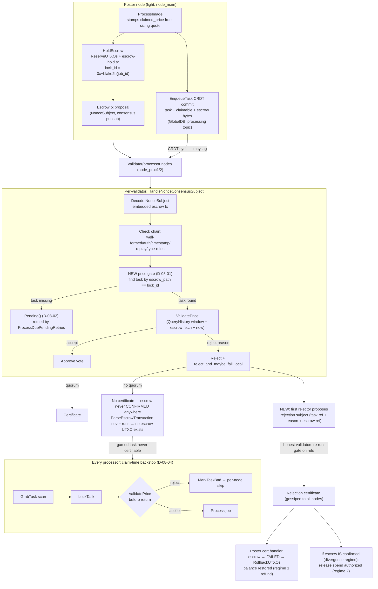

# Phase 8: Consensus Integration - Research

**Researched:** 2026-10-06
**Domain:** C++17 SuperGenius node — consensus transaction validation, escrow UTXO lifecycle, CRDT task queue, multi-node GTest integration (private codebase; no external libraries involved)
**Confidence:** HIGH (all integration seams read from source this session; open design questions listed explicitly)

## Summary

Phase 8 wires the Phase 7 pure validator (`ValidatePrice`) into two enforcement points — the consensus escrow gate (`TransactionConsensusHandler::ValidateTransactionForConsensus`) and the claim-time backstop (`TaskQueueImpl::GrabTask`) — and adds a rejection-propagation/refund mechanism plus a 3-node loopback test. The critical research finding is that **the escrow release machinery D-08-05 assumes is only a wire-format today**: `EscrowReleaseTx` exists in `SGTransaction.proto` and in the `EmbeddedTransaction` oneof, but there is **no C++ transaction class, no parser-map entry, no builder, and no consensus subject** for it — the existing payout path (`PayEscrow`) spends the escrow with a plain `TransferTransaction` signed by the local account. The phase must build the release path, not merely invoke it.

The second critical finding resolves the CONTEXT.md landmine ("the rejector constructs a release referencing an escrow it did not apply locally"): **a certified transaction is applied on receiving nodes WITHOUT re-running `ValidateTransactionForConsensus`** — `OnConsensusCertificate` deserializes the embedded tx and calls `ChangeTransactionState(tx, CONFIRMED)` directly, and CRDT-synced transactions only become CONFIRMED when a matching certificate exists. Therefore a Reject verdict matters only at *vote* time (it prevents the certificate from forming). If an honest majority rejects, the escrow is never CONFIRMED anywhere, `ParseEscrowTransaction` never runs on any node, and **no escrow UTXO ever exists to spend**. The refund in the all-honest test topology is consequently a *reservation rollback* on the poster (FAILED → `RollbackUTXOs`), not a UTXO spend. A UTXO-spend release (`EscrowReleaseTx`) is only meaningful in the divergence regime where the escrow certified anyway (mixed-version/NO_COVERAGE-approved networks). The plan must handle both regimes; the 3-node TEST-02 topology exercises the reservation regime.

Third finding: the poster-side refund has a real gap today — an outgoing escrow that never certifies reaches `UNCONFIRMED` on inconclusive expiry, and the `UNCONFIRMED` transition releases the nonce but **does not roll back UTXO reservations** (only the `FAILED` transition does, via `RollbackUTXOs`). Since `GetBalance()` counts only `UTXO_READY` outpoints (RESERVED excluded), the poster's visible balance stays reduced unless something drives the escrow to FAILED. The D-08-06 rejection subject certified via consensus is the natural carrier: the poster's node observes the certificate (via a `RegisterCertificateHandler` for the new subject type) and transitions its escrow to FAILED → rollback → balance restored (D-08-13).

**Primary recommendation:** Implement as (1) gate in the escrow branch of the check chain with Pending-on-missing-task, (2) backstop in `GrabTask` beside `IsProcessingValid`, (3) a new `sgns.task_rejection.v1`-style subject proposed by the first rejector whose certificate (a) drives the poster's escrow to FAILED + reservation rollback and (b) authorizes the release spend only when the referenced escrow is actually CONFIRMED, and (4) TEST-02 extending `ProcessingNodesTest` by posting via `ProcessImage`, flipping the loopback stub price so both processors' `QueryHistory` windows diverge from the claim, then asserting no processing, and poster balance restoration.

<user_constraints>
## User Constraints (from CONTEXT.md)

### Locked Decisions
- **D-08-01 Gate location:** enforcement lives in the **existing consensus transaction-validation path** — extend `TransactionConsensusHandler::ValidateTransactionForConsensus` (escrow transactions, via the `ParseEscrowTransaction` dispatch context) to cross-reference the claiming task's `claimed_price` and run `ValidatePrice`. Explicit user direction: "run it at CRDT sync… we have existing consensus mechanisms in place, maybe in TransactionManager — follow that." Not a GlobalDB new-element callback. — **Reversibility:** costly — touches the shared consensus validation chain every transaction passes through.
- **D-08-02 Missing-task ordering:** the poster commits escrow *before* the task element (two CRDT transactions). When the escrow arrives without its task record, the gate returns **`Pending()`** (existing migration-allowlist precedent in `TransactionConsensusHandler.cpp` ~line 485) — never reject on absence. Deterministic convergence preserved. — **Reversibility:** reversible.
- **D-08-03 Reject semantics:** a Reject verdict means the escrow transaction is **not applied on the rejecting node** — the gamed job's funding vanishes from that node's state and the task is never claimable there. Escrow *return* to the poster is a separate mechanism (below), not part of the reject verdict. — **Reversibility:** costly — consensus-visible behavior; undo changes what honest nodes do with already-seen gamed jobs.
- **D-08-04 Claim-time backstop:** `TaskQueueImpl::GrabTask` runs `ValidatePrice` before `LockTask`; on reject it uses the existing `MarkTaskBad` skip. Belt-and-suspenders for catchup-synced tasks and any gate/visibility gap; cheap because the validator is pure. — **Reversibility:** reversible.
- **D-08-05 Release trigger:** the **first honest rejector** constructs the consensus-certified `EscrowReleaseTx` back to the poster's `release_address` — immediate, no TTL wait, no poster action. Existing `EscrowReleaseTx{release_amount, release_address, original_escrow_hash}` fields carry everything needed. — **Reversibility:** reversible.
- **D-08-06 Authorization mechanism:** a **new typed consensus subject for rejection releases** (task ref + typed reject reason + escrow ref) that honest validators verify independently — reuses consensus subject machinery; no task result exists to ride the existing TASK_RESULT subject. — **Reversibility:** one-way — a new consensus subject type is a published protocol contract (Consensus.proto); removing it after nodes have certified subjects breaks compatibility.
- **D-08-07 Refund amount:** **full refund, no burn** — the escrow-release burn-basis-points do not apply to rejection refunds. Gaming is already prevented by rejection; penalties for repeat offenders were explicitly deferred in Phases 6/7. — **Reversibility:** reversible.
- Concurrent/duplicate releases of the same escrow are guarded by existing UTXO double-spend rules (a release spends the escrow UTXO; the second release fails as a double-spend).
- **D-08-08 Convergence definition:** convergence = **no honest node ever processes a job it did not verify**. Per-node fail-closed is acceptable: a `NO_COVERAGE` node skipping an honest job is harmless; a covered node processing an honestly-priced job is fine. Identical verdicts everywhere are NOT required (and NO_COVERAGE divergence is tolerated). — **Reversibility:** reversible — test assertions encode this invariant.
- **D-08-09 Rejection propagation:** "do whatever existing consensus does" — rejection propagation rides existing consensus mechanics (the rejection-release subject and validation verdicts); **no extra CRDT rejection marker** or side-channel record. — **Reversibility:** reversible.
- **D-08-10 Task cleanup:** **per-node skip only** — after rejection, each node independently never claims the task (gate + backstop); no network-wide claimable-list tombstone. Matches existing `MarkTaskBad` semantics; smaller diff. — **Reversibility:** reversible.
- **D-08-11 Test home:** **extend the existing `ProcessingNodesTest` suite** with new test cases (3-node fixture: light poster + 2 processors). One suite, shared setup cost. — **Reversibility:** reversible.
- **D-08-12 Gamed-job construction:** post via the **real `ProcessImage` wire path**, then flip the loopback stub's served price (or the validator band via `SGNS_PRICEVAL_*` env) so the posted claim is out-of-band relative to what validator nodes observe. No hand-built Task proto injection for the multi-node case. — **Reversibility:** reversible.
- **D-08-13 Refund proof:** assert the poster's GNUS balance returns to its pre-post level (full refund per D-08-07) **and/or** `WaitForEscrowRelease` confirms the release on the poster's node. — **Reversibility:** reversible.

### the agent's Discretion
- Exact rejection-subject proto message name, fields, and field numbers in `Consensus.proto`; where the subject type constant lives (`SubjectTypeMatches` switch).
- Where the escrow→task cross-reference lookup lives (a `TransactionConsensusHandler` helper vs a `TransactionManager` query seam).
- How Pending verdicts get re-evaluated when the task record lands (reuse existing pending machinery).
- Release construction plumbing: reuse `AsyncPayEscrow`-style async pattern or a new dedicated helper.
- How the claim-time backstop obtains `PriceValidationInput` inputs (escrow fetch seam) without blocking `GrabTask`.
- Logging/metrics naming for gate verdicts; test helper organization inside `processing_nodes_test.cpp`.

### Deferred Ideas (OUT OF SCOPE)
- Trust/reputation value for posters and consensus-applied penalties for repeat bad actors (carried from Phases 6/7; later milestone).
- Tolerance/window defaults derived from real GNUS volatility telemetry (carried from Phase 7; config knobs make this tunable).

### Reviewed Todos (not folded)
- "Fix Vulkan capability-probe deadlock/crash in ProcessingManager::Create path" — keyword-only match ("validator"), unrelated domain; re-reviewed this phase (also reviewed in Phase 7); remains an open testing todo in its own right.
</user_constraints>

<phase_requirements>
## Phase Requirements

| ID | Description | Research Support |
|----|-------------|------------------|
| CONS-01 | A node receiving a task over CRDT/graphsync runs the validator before processing; rejected tasks are not processed | Gate seam verified at `ValidateTransactionForConsensus` check chain + escrow branch pattern; backstop seam verified in `GrabTask` beside `IsProcessingValid`/`MarkTaskBad`; validator API + input struct read verbatim |
| CONS-02 | Acceptance/rejection is deterministic enough that honest validators converge, and a rejected job's escrow is returned to the poster | Purity contract verified (`now` injected); Pending-retry machinery verified; **dual refund regimes identified** (reservation rollback vs UTXO-spend release) with the UNCONFIRMED-doesn't-roll-back gap — the release path must be built (EscrowReleaseTx has no C++ machinery today) |
| CONS-03 | A poster who games the price (high or low) is rejected by honest validators | Deterministic check order (D-07-11) + band semantics verified; AboveBand/BelowBand/NoCoverage reasons verbatim; escrow→task cross-reference route identified (task.escrow_path == escrow uncle_hash == job-derived lock_id) |
| TEST-02 | Multi-node integration test: honest job accepted, gamed-price job rejected, using the loopback stub price source | `ProcessingNodesTest` fixture verified in detail (3 nodes, `HttpStubServer` stub, `ScopedEnvVar` redirects, local-trust setup); single-process/shared-env constraint identified (stub flip, not per-node env); existing `PostProcessing` test appears truncated at line 540 |
</phase_requirements>

## Architectural Responsibility Map

| Capability | Primary Tier | Secondary Tier | Rationale |
|------------|-------------|----------------|-----------|
| Price verdict computation (pure) | `coinprices` (Phase 7 validator) | — | Already shipped; phase only supplies inputs and consumes verdicts |
| Consensus gate (vote-time rejection) | `transaction/TransactionConsensusHandler` | `transaction/TransactionManager` (fetch/parse seams) | D-08-01 locks this; the check chain and Pending precedent live in the handler |
| Escrow fetch + escrow→task cross-reference | `transaction` layer via `GlobalDB` | `processing` key namespace | `FetchTransaction(globaldb, escrow_path)` is a TransactionManager static; task records live under TaskKeys in the same GlobalDB |
| Price-history evidence (`QueryHistory`) + config | `account/GeniusNode` (owns `LocalPriceManager`, `priceManager_`) | injected seam into the gate | TransactionManager does NOT own the price manager — evidence must be injected (callback/interface) at wiring time |
| Claim-time backstop | `processing/TaskQueueImpl` | `account/GeniusNode` (input assembly) | D-08-04; `GrabTask`/`MarkTaskBad` verified |
| Rejection subject type + certificate plumbing | `blockchain/Consensus` (proto + `CheckSubject` + handler registration) | `transaction` (subject construction, release application) | Subject-type switch + Register{Subject,Certificate}Handler pattern verified |
| Release construction (regime 2) | `transaction/TransactionManager` (PayEscrow precedent) | new `EscrowReleaseTransaction`-style class | Escrow UTXO spend pattern verified: fetch record → sign input with local account → submit |
| Poster-side refund (regime 1) | `transaction/TransactionManager` state machine (`FAILED` → `RollbackUTXOs`) | poster's certificate handler for the new subject | Verified: only FAILED rolls back reservations; UNCONFIRMED does not |
| Multi-node proof | `test/src/processing_nodes` | `testutil` (HttpStubServer, ScopedEnvVar, wait_condition) | D-08-11; fixture verified |

## Standard Stack

### Core
All in-repo C++17 — **no new external packages this phase.**

| Component | Location | Purpose | Why Standard |
|-----------|----------|---------|--------------|
| `ValidatePrice` | `src/coinprices/PriceValidator.hpp/.cpp` | Pure verdict (Phase 7, uncalled in production today) | The entire decision core; phase supplies inputs |
| `ResolvePriceValidatorConfig()` | `src/coinprices/PriceValidator.hpp:240` | `SGNS_PRICEVAL_*` env overrides | Existing config pattern; not cached per-call |
| `PriceObservationWindow(T, config)` | `src/coinprices/PriceValidator.hpp:113-121` | The ONE shared window formula for `QueryHistory` bounds | Prevents caller/validator window drift |
| `LocalPriceManager::QueryHistory(from, to)` | `src/coinprices/LocalPriceManager.hpp:131` | `PriceHistoryStats{count,min,max}` evidence | Phase 6 history; in-memory only |
| `TokenAmount::CalculateCostMinions` | `src/account/TokenAmount.hpp:115` | Cost-binding oracle | `static outcome::result<uint64_t> CalculateCostMinions( uint64_t total_bytes, double price_usd_per_genius );` |
| `TransactionConsensusHandler` | `src/transaction/TransactionConsensusHandler.cpp` | Gate host + Pending precedent + cert application | D-08-01/D-08-02 |
| `ConsensusManager` subject machinery | `src/blockchain/Consensus.cpp/.hpp` + `impl/proto/Consensus.proto` | New subject type, CheckSubject branch, proposals/certificates | Existing typed-subject pattern |
| `ProcessingNodesTest` fixture | `test/src/processing_nodes/processing_nodes_test.cpp` | TEST-02 host | D-08-11 |

### Supporting
| Component | Location | When to Use |
|-----------|----------|-------------|
| `FetchTransaction(db, key)` | `src/transaction/TransactionManager.cpp:2428` | Gate/backstop escrow fetch (reads CRDT record, not UTXO ledger) |
| `MarkTaskBad` / `incompatible_jobs_` | `src/processing/impl/TaskQueueImpl.cpp:215` | Backstop skip (in-memory, per-node — matches D-08-10) |
| `PayEscrow` / `AsyncPayEscrow` | `src/transaction/TransactionManager.cpp:1219/1309` | Release-construction precedent (regime 2) |
| `WaitForEscrowRelease` | `src/transaction/TransactionManager.cpp:3062`; `GeniusNode.cpp:3754` | D-08-13 poster-side proof |
| `ScopedEnvVar`, `HttpStubServer`, `wait_condition` | `test/src/testutil/`, `test/src/processing_nodes/HttpStubServer.hpp` | TEST-02 hermetic control |
| GTest ~1.14 | `test/` | Existing framework |

### Alternatives Considered
| Instead of | Could Use | Tradeoff |
|------------|-----------|----------|
| New rejection subject (D-08-06, locked) | Reuse `NonceSubject` embedding the release tx | Rejected by user decision — the rejection *fact* (task ref + reason) needs independent verification before any release is authorized; nonce subject only validates the tx itself |
| `EscrowReleaseTx`-typed release (regime 2) | Plain `TransferTransaction` spend (PayEscrow pattern) | Typed release carries `original_escrow_hash`/`release_address` for observers and `WaitForEscrowRelease`; a plain transfer already satisfies the current `WaitForEscrowRelease` spend-scan. Typed class = more new machinery; transfer = less protocol surface. Planner should pick per the "follow existing mechanisms" principle — see Open Question 3 |

**Installation:** none — no package installs. **Version verification:** not applicable (no registry packages).

## Package Legitimacy Audit

**No external packages are installed or recommended this phase.** All work is in-repo C++17 (SuperGenius), protobuf, and GTest already present in the build. Disposition: nothing to audit.

## Architecture Patterns

### System Architecture Diagram



### Recommended Project Structure
```
SuperGenius/src/
├── blockchain/
│   ├── Consensus.hpp/.cpp          # + subject-type constant, CheckSubject branch, Create*Subject helper
│   └── impl/proto/Consensus.proto  # + rejection-subject message (one-way protocol change, D-08-06)
├── transaction/
│   ├── TransactionConsensusHandler.cpp  # + price gate in ValidateTransactionForConsensus chain
│   ├── TransactionManager.cpp/.hpp      # + rejection-release construction; poster-side FAILED trigger; cert handler registration
│   └── (optional) EscrowReleaseTransaction.hpp/.cpp  # only if typed release chosen
├── account/
│   └── GeniusNode.cpp                  # + wiring: evidence provider (QueryHistory+now) into gate/backstop
└── processing/impl/
    └── TaskQueueImpl.cpp               # + ValidatePrice backstop in GrabTask
SuperGenius/test/src/processing_nodes/
    └── processing_nodes_test.cpp        # + TEST-02 cases on existing fixture
```

### Pattern 1: Typed check chain with Pending escape hatch (D-08-01/D-08-02)
**What:** `ValidateTransactionForConsensus` is a fixed fail-fast chain; "can't decide yet" is expressed as `ValidationResult::Pending()`.
**When to use:** exactly the gate's missing-task case.
**Example — the verified chain and precedent** (`src/transaction/TransactionConsensusHandler.cpp`):
```cpp
// Source: SuperGenius/src/transaction/TransactionConsensusHandler.cpp:510-555 (verbatim order)
if ( !CheckTransactionWellFormed( tx ) )        { return Reject(); }
if ( !owner_.CheckTransactionAuthorization( tx ) ){ return Reject(); }
if ( !CheckTransactionTimestamp( tx ) )         { return Reject(); }
if ( !owner_.CheckParentChildAuthority( tx ) )  { return Reject(); }
auto replay_result = EvaluateTransactionReplayProtection( tx ); // Approve or return
if ( !CheckTransactionTypeRules( tx ) )         { return Reject(); }
return Approve();
```
```cpp
// Source: SuperGenius/src/transaction/TransactionConsensusHandler.cpp:485-491 (migration-allowlist Pending precedent, verbatim shape)
if ( eligibility_result.has_error() )
{
    logger_->warn( "... pending" );
    return ConsensusManager::ValidationResult::Pending();
}
```
The gate slot: an escrow-typed branch (`tx.GetType() == "escrow-hold"`) after the existing checks, cross-referencing the task and running `ValidatePrice`, returning Reject/Pending without touching other tx types.

### Pattern 2: Pending re-evaluation is already built
**What:** Pending proposals are parked (`AddPendingProposal`), retried on a schedule (`ProcessDuePendingRetries`), and re-run through the **subject handler** (which re-enters the full validation chain including the gate) — verified at `Consensus.cpp:1169-1235` (`RetryPendingProposal` re-invokes `subject_handler( proposal.subject() )`; `if ( validation_result.check == Check::Pending ) { AddPendingProposal(...) }`) and `WakePendingDependency`/`ProcessDuePendingRetries`. Entries have `expires_at` and `min_dependency_retry_interval`.
**When to use:** D-08-02 needs zero new machinery — the gate just returns Pending; retries re-evaluate once the task record syncs.

### Pattern 3: Typed consensus subject + handler registration
**What:** New subject types follow the three-part pattern: (a) proto message + type string constant, (b) `CheckSubject` validation branch, (c) subject/certificate handler registration at TransactionManager init.
**Example — the pattern pieces, verbatim:**
```cpp
// Source: SuperGenius/src/blockchain/Consensus.hpp:37-39 (existing constants, verbatim)
static constexpr std::string_view NONCE_SUBJECT_TYPE          = "sgns.nonce.v1";
static constexpr std::string_view TASK_RESULT_SUBJECT_TYPE    = "sgns.task_result.v1";
static constexpr std::string_view REGISTRY_BATCH_SUBJECT_TYPE = "sgns.registry_batch.v1";
```
```protobuf
// Source: SuperGenius/src/blockchain/impl/proto/Consensus.proto:92-96 (verbatim)
message TaskResultSubject {
  string escrow_path = 1;
  bytes task_result_hash = 2;
  uint64 result_epoch = 3;
}
```
```cpp
// Source: SuperGenius/src/transaction/TransactionManager.cpp:146-166 (registration pattern, verbatim shape)
instance->blockchain_->RegisterCertificateHandler( NONCE_SUBJECT_TYPE, [...]( ... ) {
    return strong->consensus_m_->OnConsensusCertificate( subject_hash, certificate ); } );
instance->blockchain_->RegisterSubjectHandler( NONCE_SUBJECT_TYPE, [...]( const Subject &subject ) {
    return strong->consensus_m_->HandleNonceConsensusSubject( subject ); } );
```
`CheckSubject` (`Consensus.cpp:4350+`) has per-type payload validation branches (NONCE → non-empty `tx_hash`; TASK_RESULT → non-empty `escrow_path` + `task_result_hash`; REGISTRY_BATCH → epoch/roots) — the rejection subject gets an equivalent branch verifying refs are present (task ref, reason enum value, escrow ref). The subject handler for the new type re-runs the gate on the referenced task/escrow — that IS the "honest validators verify independently" of D-08-06.

### Pattern 4: Escrow spend construction (PayEscrow precedent — regime 2 release)
**What:** Spending a held escrow does not require owning the escrow: fetch the record from GlobalDB, build the input referencing the escrow outpoint, sign with the local account, submit.
**Example — verified core of `PayEscrow`** (`src/transaction/TransactionManager.cpp:1219-1305`):
```cpp
// Source: SuperGenius/src/transaction/TransactionManager.cpp:1257,1291-1303 (verbatim core)
BOOST_OUTCOME_TRY( auto transaction, FetchTransaction( *globaldb_m, escrow_path ) );
...
InputUTXOInfo escrow_utxo_input;
escrow_utxo_input.txid_hash_  = base::Hash256::fromReadableString( escrow_tx->GetHash() ).value();
escrow_utxo_input.output_idx_ = 0;
escrow_utxo_input.signature_  = account_m->Sign( escrow_utxo_input.SerializeForSigning() );
...
auto transfer_transaction = std::make_shared<TransferTransaction>(
    TransferTransaction::New( std::vector{ escrow_utxo_input }, payout_peers, FillDAGStruct( lock_id ) ) );
transfer_transaction->MakeSignature( *account_m );
EnqueueTransaction( ... );
```
The escrow output lands at a **job-derived lock address**: `const std::string lock_id = "0x" + hash_data.toReadableString();` where `hash_data = crypto::blake2b_256(job_id)` (`HoldEscrow`, `TransactionManager.cpp:1090-1092`) — anyone can compute it; the spend is authorized by signature + consensus rules, which is what makes a rejector-constructed release possible. **But note: this only works when the escrow actually CONFIRMED (UTXO exists).** `BuildPayoutOutputs` shows the full-refund shape: burn is `escrow_amount * basis_points / BASIS_POINTS_TOTAL`; D-08-07 (no burn) ⇒ a single output of the full `escrow_tx->GetAmount()` to the poster's `release_address`.

### Pattern 5: In-memory per-node skip (D-08-10)
**What:** `MarkTaskBad` is a per-process set insert, not a CRDT write:
```cpp
// Source: SuperGenius/src/processing/impl/TaskQueueImpl.cpp:215-219 (verbatim)
void TaskQueueImpl::MarkTaskBad( const std::string &taskKey )
{
    incompatible_jobs_.insert( taskKey );
    TaskQueueImplLogger()->debug( "Marked task with ID: {} as incompatible", taskKey );
}
```
The backstop reuses exactly this — no tombstone, matching D-08-10.

### Anti-Patterns to Avoid
- **Rejecting on absence:** never return Reject because the task record hasn't synced (breaks honest posters; D-08-02). Use Pending.
- **A second CRDT rejection marker:** D-08-09 forbids it; rejection facts ride the consensus subject.
- **Querying the price manager from inside the validator:** `ValidatePrice` is pure; all I/O (QueryHistory, escrow fetch, clock) belongs to the caller (D-07-12, purity contract in `PriceValidator.hpp:9-16`).
- **Assuming a Reject verdict blocks a later certificate:** it does not — `OnConsensusCertificate` applies certified txs without re-running the price gate (see Pitfall 3). Rejection prevents certificate *formation*; the backstop prevents *processing*.
- **Spending an uncertified escrow:** if no certificate ever formed, `ParseEscrowTransaction` never ran on any node and there is no outpoint; a release tx would reference a nonexistent UTXO and be rejected by honest validators. Refund in that regime is poster-side reservation rollback.

## Don't Hand-Roll

| Problem | Don't Build | Use Instead | Why |
|---------|-------------|-------------|-----|
| Retry/backoff for "can't decide yet" verdicts | Custom timers | `AddPendingProposal` + `ProcessDuePendingRetries` + `WakePendingDependency` (Consensus.cpp:1036-1295) | Admission caps, expiry, dependency wake already built and tested |
| Certificate creation/validation/propagation | Custom gossip | `ConsensusManager` proposal→vote→certificate pipeline; `RegisterCertificateHandler` | Existing, crypto-verified; D-08-09 "do whatever existing consensus does" |
| Double-release protection | Refund dedup set | UTXO double-spend rules (D-08-05 note in CONTEXT) | A release spends the escrow outpoint; second spend fails structurally |
| Release tx construction | New serialization from scratch | `PayEscrow` precedent (fetch + input + sign + submit); `FillDAGStruct`, `EnqueueTransaction` | Matches escrow spend semantics incl. lock_id fallback (`escrow_tx->GetUncleHash()`) |
| Time source | Hidden clock reads | Inject `std::chrono::system_clock::now()` at the call site into `PriceValidationInput.now` | Purity contract (CONS-02 determinism prerequisite) |
| Window math | Local window derivation | `PriceObservationWindow(dagTimestamp, config)` | "The ONE shared window formula" — caller and validator can never drift |

**Key insight:** every mechanism this phase needs — pending retries, subject certification, escrow spends, per-node skips — already exists in some form; the phase's novelty is limited to the gate branch, the rejection subject, and the poster-side refund trigger. Follow the existing shapes exactly.

## Runtime State Inventory

> Not a rename/refactor/migration phase — omitted per protocol (greenfield wiring of new enforcement + test).

## Common Pitfalls

### Pitfall 1: Two refund regimes — the release tx cannot refund an uncertified escrow
**What goes wrong:** Building D-08-05 as "always construct a release spend" fails in the all-honest topology: when honest validators reject, no certificate forms, `ParseEscrowTransaction` never runs on ANY node (it runs only on the CONFIRMED transition, `TransactionManager.cpp:4776-4810` `ParseTransaction` under `apply_effects`), so **no escrow UTXO exists to spend** — honest validators would reject the release for spending a nonexistent outpoint.
**Why it happens:** `EscrowReleaseTx` semantics assume a held UTXO; rejection prevents the hold from ever materializing.
**How to avoid:** Split regimes explicitly. Regime 1 (escrow never certified — the TEST-02 case): refund = poster-side `FAILED` transition → `RollbackUTXOs` reservation release. Regime 2 (escrow certified despite local rejection — mixed networks): refund = release spend authorized by the rejection certificate. Gate regime-2 construction on `escrow status == CONFIRMED`.
**Warning signs:** release tx rejected with outpoint errors in the multi-node test; poster balance never restored.

### Pitfall 2: UNCONFIRMED expiry does not release the poster's escrow reservations
**What goes wrong:** An outgoing escrow that never certifies ends `UNCONFIRMED` after inconclusive expiry; that branch releases the nonce and bridge-mint reservations but **not escrow UTXO reservations** — verified: the `FAILED` branch has `RollbackUTXOs( params_opt->first, tx->GetHash() )` for local outgoing UTXO txs (`TransactionManager.cpp:4919-4933`), the `UNCONFIRMED` branch has only `ReleaseNonce` + `ReleaseBridgeMintReservation` (`4866-4890`). Since `GetBalance()` sums only `UTXO_READY` outpoints (`UTXOManager.cpp` GetBalance: `if ( utxo_it->second.state != UTXOState::UTXO_READY ) { continue; }`), the poster's visible balance stays reduced ⇒ D-08-13 assertion fails.
**Why it happens:** `HoldEscrow` uses `ReserveUTXOs`; reservation release rides only the FAILED path.
**How to avoid:** Wire the rejection certificate (D-08-06) to drive the poster's escrow `ChangeTransactionState(escrow, FAILED)` — the existing FAILED machinery then performs the rollback. (Alternative: extend the expiry path — larger blast radius.)
**Warning signs:** test sees balance_main < pre-post level with no processing having occurred.

### Pitfall 3: Certificates apply without re-running the gate
**What goes wrong:** Assuming a node's Reject verdict keeps a transaction unapplied there forever. Verified: `OnConsensusCertificate` (`TransactionConsensusHandler.cpp:61-145`) deserializes the embedded tx from the certificate and calls `ChangeTransactionState( tx, CONFIRMED )` — the price gate is NOT re-run; likewise CRDT-synced txs become CONFIRMED purely on `CertificateMatchesTransaction` (`TransactionManager.cpp:4263-4276`).
**Why it happens:** Certificate quorum is the authority by design; per-node verdicts only shape votes.
**How to avoid:** Treat the gate as "prevent certification" and the backstop as "prevent processing" (D-08-03's "not applied on the rejecting node" holds because in an honest majority the certificate never forms; in divergence the backstop still blocks processing — D-08-08's convergence definition). Do not attempt to veto certificate application locally.
**Warning signs:** planner tasks claiming "rejecting node never applies the escrow even if certified" — that is not what the code does today.

### Pitfall 4: Escrow→task lookup has no index — and claimable entries disappear on completion
**What goes wrong:** The gate receives an `EscrowTransaction`; there is no escrow→task map. The linkage is: `task.escrow_path == lock_id == escrow.GetUncleHash()` (the DAG struct is built via `FillDAGStruct( lock_id )` in `HoldEscrow`; `ProcessImage` sets `task.set_escrow_path( escrow_path )` where `escrow_path` is the returned `lock_id`). Task records live under `TaskKeys::TaskKey( taskId )` = `"/processing_<ver>/tasks/<taskId>"` with claimable entries under `"/processing_<ver>/claimable/<taskId>"` (verbatim suffix constants: `TASK_LIST_SUFFIX = "/tasks"`, `CLAIMABLE_LIST_SUFFIX = "/claimable"`, `LOCK_KEY_PREFIX = "/lock_"`, `PROCESSING_PREFIX_BASE = "/processing_"` — `TaskKeys.hpp:55-66`). A completed task is removed from claimable (`CompleteTask` does `Remove(ClaimableTaskKey)`), and lock_id is a one-way hash (blake2b of the uuid) so you cannot invert to the taskId.
**How to avoid:** Scan the claimable list (small) matching `task.escrow_path() == escrow.GetUncleHash()`; on no match return Pending (retry until expiry — harmless). Keep the scan bounded; cache per-escrow_hash verdicts within a validation pass if needed.
**Warning signs:** gate Rejects on lookup miss (violates D-08-02); unbounded scans over all tasks.

### Pitfall 5: `now` drift between vote and retry changes verdicts
**What goes wrong:** `maxAge` default is 600s; a Pending escrow retried after the task syncs evaluates with a later `now` — a task that was in-age at first sight can become `TimestampStale` at retry, or a `NoCoverage` node can gain coverage and flip to accept/reject.
**Why it happens:** Purity requires injected `now`; retry machinery legitimately re-runs the handler.
**How to avoid:** Accept it — D-08-08 tolerates per-node verdict divergence, and the backstop re-checks at claim time anyway. Log reason codes. Do NOT cache verdicts across time.
**Warning signs:** attempts to pin `now` to the escrow timestamp (that would let a poster pre-choose the validation moment).

### Pitfall 6: Single-process test — env knobs cannot diverge per node
**What goes wrong:** All 3 fixture nodes share one process and one environment; `SGNS_PRICEVAL_*` and the stub URL apply to poster and validators alike. Setting a tight band to force rejection also affects the poster's own pricing fetch (stub serves one price to everyone).
**How to avoid:** Use the D-08-12 stub-flip: post the honest job while the stub serves price X; then re-`OnPath` the stub to Y (far outside ±tolerance) so validators' *subsequent* fetches populate `QueryHistory` with Y-window evidence; their windows around the escrow timestamp then exclude the claim ⇒ AboveBand/BelowBand/NoCoverage reject. Ensure validator nodes actually fetch after the flip (a fetch is triggered by price consumers / the NO_COVERAGE self-heal `ShouldTriggerRefetch`); the test may need to force a quote fetch on each processor. Note the poster (light node) is assumed not to be a voting validator (Assumption A1), so its own gate never runs on its proposal.
**Warning signs:** both validators return NoCoverage (history empty) instead of band rejects; poster's node rejects its own job.

### Pitfall 7: `claimed_price` double equality and legacy handling
**What goes wrong:** Cost binding is exact integer equality (`CalculateCostMinions(blockSize, claimedPrice) == escrowAmount` — never an epsilon; `PriceValidator.hpp:135-139`); `claimed_price == 0.0` (proto3 absent field 6) is `LegacyNoPrice` reject (D-07-08 fail-closed). Non-finite/negative claims → `CostMismatch` before the oracle.
**How to avoid:** Use the validator as-is; blockSize must be recomputed exactly as the poster did: `procmgr.ParseBlockSize()` over the task json (`GetProcessCost`, `GeniusNode.cpp:2815-2843`: `auto blockLen = procmgr.ParseBlockSize();` then `TokenAmount::CalculateCostMinions( blockLen.value(), gnusPrice )`). The backstop must run the same `ParseBlockSize` on `task.json_data()` or cost binding will false-reject honest jobs.
**Warning signs:** honest jobs rejected with CostMismatch in the multi-node test ⇒ blockSize derivation mismatch.

### Pitfall 8: The existing `PostProcessing` test is truncated
**What goes wrong:** Extending a test file whose active case ends mid-body (`processing_nodes_test.cpp:540` ends at `auto balance_main = node_main->GetBalance();` with no assertions following — the file's last line).
**How to avoid:** Treat the tail as incomplete scaffolding; TEST-02 cases should be self-contained new `TEST_F`s; expect fixture teardown landmines already documented there (ordered StopNode, port reuse).

## Code Examples

### Gate sketch (D-08-01/D-08-02) — inside `ValidateTransactionForConsensus`'s chain
```cpp
// Sketch — new escrow branch (placement per Pattern 1; names at planner's discretion)
if ( tx.GetType() == "escrow-hold" )  // registered parser key, verbatim from
                                     // TransactionManager.cpp:116-117: { "escrow-hold", { Parse..., Revert... } }
{
    auto verdict = ValidateEscrowPriceGate( static_cast<const EscrowTransaction &>( tx ) );
    if ( verdict.check == ConsensusManager::Check::Pending ) return Pending(); // D-08-02
    if ( verdict.check != ConsensusManager::Check::Approve )  return Reject();
}
```
The helper: locate the task via `TaskKeys::ClaimableListKey()` scan matching `task.escrow_path() == escrow.GetUncleHash()`; on miss → Pending. On hit, assemble `PriceValidationInput`:
```cpp
// Field set verbatim from PriceValidator.hpp:86-94:
// claimedPrice, escrowAmount, dagTimestamp, blockSize, now, stats
PriceValidationInput in{};
in.claimedPrice  = task.claimed_price();                 // SGProcessing.proto:23: double claimed_price = 6;
in.escrowAmount  = escrow_tx->GetAmount();
in.dagTimestamp  = std::chrono::system_clock::time_point{ std::chrono::seconds{ escrow_tx->GetTimestamp() } };
in.blockSize     = /* ProcessingManager::Create(task.json_data())->ParseBlockSize() */;
in.now           = std::chrono::system_clock::now();
const auto cfg   = ResolvePriceValidatorConfig();        // PriceValidator.hpp:240
in.stats         = evidence_provider_->QueryHistory( PriceObservationWindow( in.dagTimestamp, cfg ).from,
                                                     PriceObservationWindow( in.dagTimestamp, cfg ).to );
auto result      = ValidatePrice( in, cfg );
if ( ShouldTriggerRefetch( result.reason ) ) evidence_provider_->TriggerBackgroundFetch(); // D-07-06
```
Reason taxonomy verbatim (`PriceValidator.hpp:46-55`): `Accepted, LegacyNoPrice, TimestampFuture, TimestampStale, CostMismatch, AboveBand, BelowBand, NoCoverage`.

### Backstop sketch (D-08-04) — in `GrabTask`, beside `IsProcessingValid`
```cpp
// Verified insertion point — TaskQueueImpl.cpp:158-168 current shape:
//   LockTask(taskKey) → GetTask(taskId) → IsProcessingValid(task.json_data()) → MarkTaskBad → continue
// Insert after GetTask, around the IsProcessingValid check:
if ( !price_backstop_( task ) )   // assembles PriceValidationInput (escrow fetch via
{                                 // FetchTransaction(globaldb, task.escrow_path())) and runs ValidatePrice
    MarkTaskBad( taskId );        // existing skip — TaskQueueImpl.cpp:215, verbatim semantics
    continue;
}
```
Keep it synchronous but cheap: escrow fetch is a GlobalDB local read; QueryHistory is in-memory. If a non-blocking variant is required (discretion), return the task to the scan without locking and schedule an async check — but note `GrabTask` already locks before `GetTask`, so a synchronous pure check adds negligible latency.

### Rejection subject (D-08-06) — proto + constant (names are agent's discretion)
```protobuf
// Sketch — add beside TaskResultSubject (Consensus.proto:92-96). Field numbers are new; one-way once shipped.
message TaskRejectionSubject {
  string escrow_path = 1;        // == task.escrow_path == escrow lock_id
  string task_id = 2;            // task.ipfs_block_id
  uint32 reject_reason = 3;      // PriceValidationReason value (typed reason per D-08-06)
  string original_escrow_hash = 4;
}
// Constant beside Consensus.hpp:37-39, e.g.: "sgns.task_rejection.v1"
```
Verification (subject handler) re-runs the gate on the referenced escrow+task from local GlobalDB and requires the recomputed reason to match `reject_reason` — deterministic inputs make this check sound on honest nodes. CheckSubject branch mirrors TASK_RESULT's non-empty-ref checks.

### Poster-side refund trigger (regime 1)
```cpp
// Register (TransactionManager::New, beside the NONCE registrations at TransactionManager.cpp:146-166):
blockchain_->RegisterCertificateHandler( TASK_REJECTION_SUBJECT_TYPE,
    [weak_self]( subject_hash, certificate ) {
        // decode subject → escrow ref → if tracked tx exists locally:
        // ChangeTransactionState( escrow_tx, TransactionStatus::FAILED )
        // → existing FAILED machinery performs RollbackUTXOs (poster's reservations released)
    } );
```
Verified FAILED rollback shape (`TransactionManager.cpp:4919-4933`): local outgoing UTXO txs get `RollbackUTXOs( params_opt->first, tx->GetHash() )`.

### Regime-2 release (only when escrow CONFIRMED) — PayEscrow-shaped
See Pattern 4. Full refund per D-08-07: single output of `escrow_tx->GetAmount()` to the poster's `release_address`, zero burn (contrast `BuildPayoutOutputs`, which always emits `{ burn + dust, BURN_ADDRESS, token }` — the rejection release must NOT use BuildPayoutOutputs).

### TEST-02 skeleton (D-08-11/D-08-12/D-08-13)
```cpp
TEST_F( ProcessingNodesTest, GamedPriceJobRejectedAndRefunded )
{
    // Fixture already: price_stub_ OnPath "/api/v3/simple/price" -> {"genius-ai":{"usd":1.0}}
    //   (processing_nodes_test.cpp:52-56, verbatim); 3 nodes with local trust.
    // 1. Mint to poster; record balance_before = node_main->GetBalance();
    //    (GetBalance counts only UTXO_READY — reservations reduce it: Pitfall 2/6 grounding)
    // 2. Post honest job via node_main->ProcessImage(...) (real wire path, D-08-12);
    //    wait_condition: some processor completes it (existing PostProcessing flow).
    // 3. price_stub_.OnPath( "/api/v3/simple/price", {200, "application/json",
    //        R"({"genius-ai":{"usd":50.0}})"} );   // flip far outside ±10% default band
    //    force quote fetch on both processors (consume GetGNUSPrice / rely on refetch self-heal)
    // 4. Post gamed job via ProcessImage while stub serves 50.0 BUT claimed price comes from
    //    the sizing quote — flip timing: post while stub serves price A, then flip to B before
    //    validators vote; claim A vs validator window of B => AboveBand/BelowBand reject.
    // 5. Assert (D-08-08): neither processor processes the gamed task (wait_condition on
    //    absence + timeout), and poster balance returns to balance_before (D-08-13 regime 1),
    //    and/or WaitForEscrowRelease( escrow_tx_id, timeout ) — GeniusNode.hpp:242/246:
    //    TIMEOUT_ESCROW_PAY{50000} debug / {30000} release; allow longer in test.
}
```

## State of the Art

| Old Approach | Current Approach | When Changed | Impact |
|--------------|------------------|--------------|--------|
| Validator pure function, zero production callers (Phase 7) | First two production call sites: consensus gate + claim backstop | This phase | `ValidatePrice` moves from tested library to consensus-critical path |
| `EscrowReleaseTx` proto message only (serialized in EmbeddedTransaction dispatch, `TransactionManager.cpp:2297-2300`) | Typed release machinery (subject + class or transfer spend) — to be built | This phase | D-08-05's "existing fields" exist on the wire but NOT in C++ |
| Escrow payout via `TransferTransaction` + burn split (`BuildPayoutOutputs`) | Rejection refund: full amount, no burn (D-08-07) | This phase | Must not reuse `BuildPayoutOutputs` (always emits a burn output) |

**Deprecated/outdated:** none in-repo; do not reintroduce per-node CRDT rejection markers (D-08-09) or network-wide tombstones (D-08-10).

## Assumptions Log

| # | Claim | Section | Risk if Wrong |
|---|-------|---------|---------------|
| A1 | The light poster node (`node_main`) is not a voting validator in the fixture, so its own gate never votes on its proposal (inferred from `WriteLocalTrustSgnsConfig(..., "Light", is_processor=false, ...)` and validator-registry design; not directly verified) | Pitfall 6, Test sketch | Poster might self-reject its own gamed escrow — test still passes but measures a different path; verify during implementation |
| A2 | Generic (non-nonce) subjects can be proposed and certified through the existing pipeline the way REGISTRY_BATCH subjects are; `CreateTaskResultSubject` having no production caller means the submit plumbing is unwired but available | Pattern 3, D-08-06 | If generic-subject submission needs new plumbing, the rejection-subject task grows; check `SubmitProposal`/proposer-signing path during planning |
| A3 | With both processors rejecting (2/2 validator weight in the local-trust fixture), the escrow proposal cannot reach an approving quorum → no certificate | Pitfall 1, Diagram | If quorum rules differ (e.g., proposer self-count, light-node votes), the gamed escrow might certify and the test exercises regime 2 instead; assert which regime fired |
| A4 | The `PostProcessing` test's truncation at line 540 (ends at `auto balance_main = node_main->GetBalance();`) is incomplete scaffolding, not an intentional cut | Pitfall 8 | If the rest lives elsewhere, TEST-02 may find partial assertions to reconcile |
| A5 | `escrow_tx->GetTimestamp()` (DAG timestamp) is accessible on `EscrowTransaction` via the `GeniusTransaction` base (used by `CheckTransactionTimestamp`; exact accessor verified only by chain presence) | Code Examples | If the DAG timestamp requires `dag_st` field access instead, adjust input assembly (mechanical) |

## Open Questions

1. **Which refund regimes must ship now?** Regime 1 (poster FAILED + rollback via rejection certificate) is required for TEST-02's D-08-13 assertion. Regime 2 (release spend of a confirmed escrow) is the locked D-08-05 mechanism but cannot trigger in the all-honest 3-node topology. Recommendation: implement regime 1 fully; implement regime 2 gated on `escrow CONFIRMED` with unit-level coverage, and assert in TEST-02 which regime fired. **Needs user confirm if regime 2 must be exercised multi-node.**
2. **Rejection-subject trigger and "first rejector" dedupe:** both processors may reject; each could propose a rejection subject. Recommendation: rely on subject-hash identity — identical subject content collapses to one slot (proposals are slot-keyed; see `GetSlotKey`/slot mechanics); each rejector may propose, the network certifies one. Verify slot semantics for the new type during planning.
3. **Typed `EscrowReleaseTx` C++ class vs plain `TransferTransaction` for regime 2:** typed release carries `original_escrow_hash`/`release_address` (proto verbatim: `release_amount=3, release_address=4, escrow_source=5, original_escrow_hash=6`) and matches D-08-05's language, but requires a new tx class + parser entry + serializers (the `transaction_parsers` map verbatim today: `transfer, mint, mint-v2, migration, escrow-hold, registration, revoke` — no release entry). A transfer spend matches "follow existing mechanisms" and already satisfies `WaitForEscrowRelease`'s spend-scan. Recommendation: transfer spend, rejection subject carries the typed semantics. **Planner discretion within D-08-05/D-08-06 constraints.**
4. **Does the poster's light node register the new certificate handler?** `RegisterCertificateHandler(NONCE_SUBJECT_TYPE, ...)` happens in `TransactionManager::New` for every node type (verified at `TransactionManager.cpp:146`); the new registration should follow the same all-nodes pattern — confirm light nodes process certificates for non-nonce subjects.
5. **Backstop escrow fetch on catchup-synced tasks:** after long downtime, `task.escrow_path` must still resolve in GlobalDB (escrow bytes were committed in the same CRDT transaction as the task — verified `CreateEscrowInfoCRDTTransaction` + single-commit enqueue). If fetch fails, recommended policy: `MarkTaskBad` (fail-closed) — planner to decide and test.

## Environment Availability

| Dependency | Required By | Available | Version | Fallback |
|------------|------------|-----------|---------|----------|
| CMake | Build (SuperGenius) | ✓ | 3.29.2 | — |
| C++17 toolchain (MSVC 17 2022 / Clang / GCC per stack) | Build | ✓ (existing build tree; branch `dev_price_validation`) | — | — |
| Node.js | gsd tooling only | ✓ | 24.16.0 | — |
| git | Version control | ✓ | — | — |
| Network (loopback) | TEST-02 stub only (127.0.0.1) | ✓ | — | — |

No external services; the loopback `HttpStubServer` is hermetic. **Missing dependencies with no fallback:** none.

## Validation Architecture

> `workflow.nyquist_validation: false` in `.planning/config.json` — section skipped per protocol. (Test expectations live in Pitfalls/Code Examples; the existing suites are `test/src/price_validator/` and `test/src/processing_nodes/`.)

## Security Domain

> `security_enforcement: true`, `security_asvs_level: 1`, `security_block_on: high` — included.

### Applicable ASVS Categories

| ASVS Category | Applies | Standard Control |
|---------------|---------|-----------------|
| V2 Authentication | no | Existing key-based node identity; no new auth surface |
| V3 Session Management | no | — |
| V4 Access Control | yes | Release/subject authorization: a rejection subject must be verifiable by any honest validator (re-run gate on refs); escrow spend authorized by UTXO signature + certificate — never by proposer say-so. Griefing vector: malicious node proposing rejection subjects for honest jobs is bounded because validators re-derive the verdict deterministically |
| V5 Input Validation | yes | `claimed_price` is a poster-controlled double on the wire; Phase 7 already fail-closes non-finite/negative (`CostMismatch` before the oracle — verified comment `PriceValidator.hpp:127-131`) and proto3-absent (`LegacyNoPrice`). New surface this phase: rejection-subject fields (refs must be validated non-empty + re-verified in CheckSubject branch), and env knobs already range-checked (`ReadEnvDoubleInRange`/`ReadEnvPositiveSeconds` never propagate NaN/non-positive durations — verified) |
| V6 Cryptography | no (no new crypto) | blake2b lock ids, signatures, certificate quorum checks all reused as-is |

### Known Threat Patterns for C++ P2P consensus + escrow

| Pattern | STRIDE | Standard Mitigation |
|---------|--------|---------------------|
| Price gaming (high/low claim) | Tampering | Gate (prevent certification) + backstop (prevent processing); typed reasons for telemetry |
| Honest-price/lowered-escrow pairing | Tampering | Cost binding exact-integer equality (D-02, shipped) |
| False rejection of honest jobs (griefing) | Elevation of Privilege | Rejection subject verified by independent re-run of the deterministic gate; divergence tolerated per D-08-08 |
| Double refund / double release | Tampering | Regime split (only CONFIRMED escrows spendable); UTXO double-spend rules (D-08-05 note) |
| Pending-proposal flood via missing tasks | DoS | Existing pending admission caps (`CanAdmitPendingProposalLocked` retained-bytes check, `Consensus.cpp:979-1082`); gate adds no unbounded state |
| Cherry-picked/stale DAG timestamps | Tampering | Timestamp bounds (TimestampFuture/TimestampStale, D-03/D-07-03); poster-set trust caveat inherited from D-06-03 |

## Sources

### Primary (HIGH confidence — all read from source this session)
- `SuperGenius/src/transaction/TransactionConsensusHandler.cpp` — check chain (~510-555), Pending precedent (~479-497), `reject_and_maybe_fail_local` (~407-449), `HandleNonceConsensusSubject` (~306-400), `OnConsensusCertificate` (~61-145)
- `SuperGenius/src/transaction/TransactionManager.cpp` — `transaction_parsers` (110-123), `HoldEscrow` (1087-1118), `BuildPayoutOutputs` (1127-1217), `PayEscrow` (1219-1305), `AsyncPayEscrow` (1309-1345), `FetchTransaction` (2428-2435), `ParseEscrowTransaction` (2836-2853), `WaitForEscrowRelease` (3062-3120), CRDT tx processing/certificate gating (4195-4285), `ChangeTransactionState` incl. CONFIRMED/UNCONFIRMED/FAILED (4652-4960), handler registrations (146-175)
- `SuperGenius/src/blockchain/Consensus.hpp` — subject-type constants (37-39), `CreateTaskResultSubject` (516)
- `SuperGenius/src/blockchain/Consensus.cpp` — pending machinery (967-1295), `HandleCertificate` (3723-3763), `CheckSubject` branches (4280-4310, 4380-4420), `CreateTaskResultSubject` (4104-4130)
- `SuperGenius/src/blockchain/impl/proto/Consensus.proto` — `EmbeddedTransaction` (78-90), `TaskResultSubject` (92-96)
- `SuperGenius/src/account/proto/SGTransaction.proto` — `EscrowTx` (114-119), `EscrowReleaseTx` (126-134)
- `SuperGenius/src/processing/proto/SGProcessing.proto` — `claimed_price = 6` (17-23)
- `SuperGenius/src/processing/impl/TaskQueueImpl.cpp` — `EnqueueTask` (32-75), `GrabTask` (123-176), `CompleteTask` (183-204), `MarkTaskBad` (215-219)
- `SuperGenius/src/processing/impl/TaskKeys.hpp` — key namespace (55-66)
- `SuperGenius/src/account/GeniusNode.cpp` — `ProcessImage` (2694-2790), `GetProcessCost` (2813-2843), `ProcessingDone`/`AsyncPayEscrow` (3415-3490), `WaitForEscrowRelease` (3754-3762)
- `SuperGenius/src/account/GeniusNode.hpp` — `priceManager_`/`GetOrCreatePriceManager` (1499-1505), `TIMEOUT_ESCROW_PAY` (242/246)
- `SuperGenius/src/account/UTXOManager.cpp` — `GetBalance` UTXO_READY-only accounting; reservation state machine
- `SuperGenius/src/coinprices/PriceValidator.hpp` — full API verbatim (enum, config, inputs, resolver, env names, window, refetch)
- `SuperGenius/src/coinprices/LocalPriceManager.hpp` — `PriceHistoryStats` (69), `QueryHistory` (131)
- `SuperGenius/src/account/TokenAmount.hpp` — `CalculateCostMinions` (115)
- `SuperGenius/test/src/processing_nodes/processing_nodes_test.cpp` — fixture (29-175), active/disabled tests (177-540)
- `.planning/workstreams/tokenprice/08-CONTEXT.md`, `07-CONTEXT.md`, `06-CONTEXT.md`, `REQUIREMENTS.md`, `STATE.md` — decisions and requirements

### Secondary / Tertiary
- None — no web or external-docs claims made; the domain is entirely this private codebase.

## Project Constraints (from copilot-instructions.md)

`./copilot-instructions.md` and `./.github/copilot-instructions.md` do not exist in this repository. `AGENTS.md` (GSD-managed) applies and its constraints are honored: C++17/C++20 matching SuperGenius conventions; Corelinux-derived style (Ullman braces, PascalCase types, `m_`/trailing-underscore members, PascalCase headers); proto changes must be backward-compatible and must not break SuperGenius/GeniusSDK/GeniusWallet builds (D-08-06's one-way proto addition satisfies this — new message + new constant, no existing field renumbered); security boundary: main-wallet keys never enter other processes (no change this phase).

## Metadata

**Confidence breakdown:**
- Standard stack (in-repo seams): HIGH — every seam read from source with verbatim quotes
- Architecture (dual refund regimes, certificate semantics): HIGH for the mechanics; MEDIUM for the regime-2 design recommendation (Open Questions 1-3)
- Pitfalls: HIGH — each grounded in a verified code path
- Test approach: HIGH on fixture facts; MEDIUM on stub-flip timing details (Pitfall 6, Assumption A1)

**Research date:** 2026-10-06
**Valid until:** 2026-11-06 (stable in-repo code; revisit if `dev_price_validation` moves under the listed line numbers)
