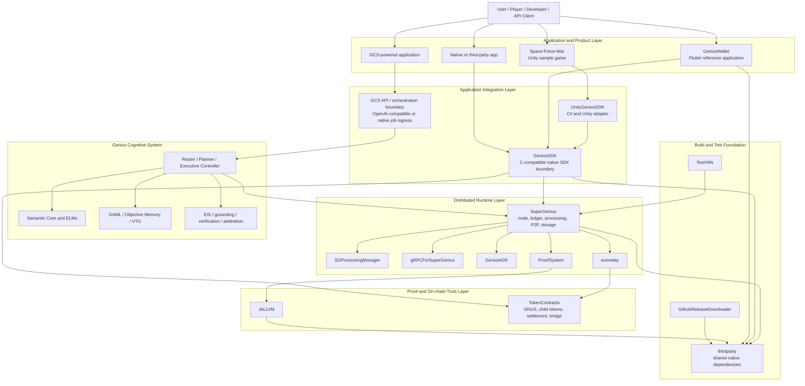

# GNUS.ai Master Platform Architecture

**Repository:** `GeniusVentures/GeniusNetwork`  
**Role:** Canonical composition and integration map for the GNUS.ai platform  
**Audience:** Application developers, game developers, platform engineers, maintainers, reviewers, coding agents, and LLMs  
**Last architecture review:** 2026-07-28

---

## 1. Purpose

This document defines how the Genius Ventures repositories and submodules fit together when building a GNUS.ai application, game, wallet, cognitive service, node, smart-contract feature, or third-party integration.

Its main purpose is to prevent developers and coding agents from rebuilding infrastructure that already exists.

Before creating a new subsystem, library, protocol, wallet implementation, game adapter, token contract, networking layer, AI job service, proof system, or dependency wrapper, search the repositories identified here and determine whether the capability already exists.

This document is the platform-level ownership map. Detailed implementation documentation remains in the repository that owns each subsystem.

### 1.1 Normative rules

1. **Reuse before creating.** Search the owner repository and its submodules before adding a new implementation.
2. **Use the highest stable abstraction available.** Applications should normally use `GeniusSDK`; Unity applications should normally use `UnityGeniusSDK`; applications should not reach directly into `SuperGenius` internals unless they are extending the runtime itself.
3. **Put changes in the owning repository.** Do not implement a runtime feature in a sample application or a token rule in an SDK wrapper.
4. **Treat samples as examples, not authorities.** `GeniusWallet` and `Space-Force-War` demonstrate integration patterns, but the public SDK and runtime contracts are authoritative.
5. **Distinguish architecture from deployed implementation.** `GeniusCognitiveSystem` contains the cognitive architecture and implementation inventory. A documented GCS component may still require implementation or integration work.
6. **Do not silently fork common dependencies.** Shared native dependencies belong in `thirdparty` unless there is an explicit reason to isolate them.
7. **Do not update a parent submodule pointer before the child change exists.** Implement, test, and merge in the child repository first; then update the pointer in the parent composition repository.
8. **Preserve branch and submodule intent.** The branch and pinned commit referenced by `GeniusNetwork` define the tested composition. A child repository's latest default branch is not automatically the version used by the platform.

---

## 2. Platform at a Glance



### 2.1 The shortest correct mental model

- **`GeniusNetwork` composes and pins the platform.**
- **`SuperGenius` runs the decentralized native node and processing network.**
- **`GeniusSDK` is the native application-facing API boundary.**
- **`UnityGeniusSDK` adapts `GeniusSDK` for Unity and C#.**
- **`GeniusWallet` is the reference cross-platform wallet/application integration.**
- **`Space-Force-War` is the reference Unity game integration.**
- **`TokenContracts` owns on-chain GNUS and child-token behavior.**
- **`GeniusCognitiveSystem` defines and coordinates the cognitive architecture that runs locally or across GNUS nodes.**
- **`zkLLVM` and `ProofSystem` own proof compilation and proof workflows.**
- **`thirdparty` owns shared native dependency acquisition and builds.**

---

## 3. Composition Repository: GeniusNetwork

`GeniusNetwork` is the umbrella repository. It is not where every subsystem should be implemented.

Its responsibilities are:

- pin compatible subsystem versions through Git submodules;
- document the complete platform topology;
- provide installation and composition guidance;
- coordinate cross-repository releases and integration testing;
- record platform-wide architecture, conventions, risks, and ownership;
- provide a stable entry point for developers cloning the complete system.

### 3.1 Direct submodules on `develop`

| Path | Repository role | Application developers should use it for |
| --- | --- | --- |
| `SuperGenius/` | Core distributed node/runtime | Runtime development, networking, ledger, processing, storage, proofs, node APIs |
| `GeniusSDK/` | Native SDK boundary | Embedding GNUS node, account, balance, transfer, pricing, and processing features in apps |
| `GeniusWallet/` | Flutter reference application | Wallet UX, account lifecycle, secure storage, cross-platform packaging, job submission patterns |
| `TokenContracts/` | EVM smart contracts | GNUS and child-token rules, bridge contracts, settlement, escrow, access control, upgrades |
| `thirdparty/` | Shared dependency build system | Adding or updating common native libraries and platform builds |
| `zkLLVM/` | Zero-knowledge compiler/toolchain | Circuit compilation, assignment, proof-related tooling, verifier generation |
| `TestVMs/` | Test environments | Reproducible VM-based platform testing |
| `GithubReleaseDownloader/` | Release support utility | Downloading GitHub release artifacts used by builds/installers |

### 3.2 Architecturally connected repositories not currently direct submodules

These repositories are part of the platform architecture even when they are not pinned directly by the current `GeniusNetwork/develop` `.gitmodules` file.

| Repository | Role | Relationship to GeniusNetwork |
| --- | --- | --- |
| `GeniusCognitiveSystem` | Cognitive architecture, specifications, module inventory, and GCS documentation | Defines how AI reasoning, memory, routing, verification, tools, and swarm cognition use GNUS infrastructure |
| `UnityGeniusSDK` | Unity/C# adapter and packaged game integration | Wraps native `GeniusSDK` artifacts for Unity applications |
| `Space-Force-War` | Reference Unity game | Demonstrates how a game consumes `UnityGeniusSDK` and replaces ad-centric monetization with GNUS participation |

Their absence from the root `.gitmodules` file does not authorize recreating their functionality inside another repository.

---

## 4. Repository and Subsystem Ownership

## 4.1 SuperGenius: distributed native runtime

`SuperGenius` owns the C++ native runtime. It is the core implementation for:

- node startup and lifecycle;
- account and transaction processing;
- the block-lattice ledger;
- peer discovery and peer-to-peer communication;
- distributed processing jobs;
- CRDT state and replicated storage;
- IPFS-based content exchange;
- RocksDB-backed persistence;
- subscriptions and message watching;
- proof generation and verification integration;
- gRPC-facing node services;
- EVM relay integration;
- local secure storage used by the runtime.

### Do not reimplement outside SuperGenius

Do not create a second P2P network, ledger, job network, node database, proof coordinator, CRDT store, or peer-discovery stack in an application repository when the work belongs in `SuperGenius`.

### Direct consumers

- `GeniusSDK` links to and wraps the runtime.
- `GeniusWallet` consumes packaged runtime/SDK functionality.
- GCS execution services use the runtime's processing, networking, storage, and trust capabilities.
- proof and relay submodules connect the native runtime to ZK and EVM systems.

## 4.2 SuperGenius nested submodules

| Submodule | Ownership |
| --- | --- |
| `gRPCForSuperGenius/` | Protocol Buffer definitions and generated gRPC interfaces for node communication |
| `GeniusKDF/` | Key-derivation functionality shared by the runtime and account/security flows |
| `ProofSystem/` | GNUS-specific proof circuits, proof orchestration, and verification integration |
| `SGProcessingManager/` | Distributed processing job schemas, generated interfaces, and processing-manager behavior |
| `docs/` | SuperGenius developer/runtime documentation maintained as its own repository |
| `evmrelay/` | Native-to-EVM relay and bridge-facing runtime integration |

A change to one of these capabilities should normally be made in its nested repository, followed by a `SuperGenius` pointer update and then, when required, a `GeniusNetwork` pointer update.

## 4.3 GeniusSDK: canonical application boundary

`GeniusSDK` is the embeddable native library that exposes GNUS runtime functionality to applications.

Its public C-compatible API exists so that C++, C#, Dart FFI, Unity, mobile, desktop, and other language bindings can use the runtime without depending on internal C++ classes.

The public API includes or is intended to include:

- SDK/node initialization and shutdown;
- initialization progress and node state;
- account creation, recovery, selection, and secure key-based initialization;
- address and token identifiers;
- balances and token-value conversion;
- transfers and transaction status;
- developer payment flows;
- processing job submission and processing status;
- native memory ownership helpers for FFI consumers.

### Boundary rule

An application should use `GeniusSDK` rather than link directly to internal `SuperGenius/src` classes unless the application is explicitly a runtime-development tool.

### Binding rule

Language and engine adapters must wrap the public `GeniusSDK` ABI. They must not duplicate account, balance, pricing, transaction, processing, or node-lifecycle logic in managed code.

## 4.4 UnityGeniusSDK: Unity adapter

`UnityGeniusSDK` owns the Unity-facing integration:

- C# P/Invoke declarations for the native GeniusSDK library;
- Unity lifecycle initialization and shutdown;
- persistent application data paths and developer configuration;
- Unity components for balance display;
- GNUS-to-display-price calculation;
- purchase and developer-payment components;
- UnityEvents and scene-friendly wrappers;
- platform packaging for Android, iOS, macOS, Windows, and Linux;
- Unity example scenes and prefabs.

### Unity rule

Do not create a new independent Unity networking, wallet, or token implementation. Extend `UnityGeniusSDK` and keep it aligned with the current `GeniusSDK` ABI.

### ABI warning

The Unity wrapper and the native SDK can evolve at different rates. Before changing P/Invoke signatures, compare them against the exact `GeniusSDK` commit being packaged. The native header is authoritative; stale sample signatures must not become a second API.

## 4.5 Space-Force-War: reference Unity game

`Space-Force-War` is a sample product, not a foundational SDK.

It demonstrates:

- importing the Unity SDK into a real Unity project;
- initializing GNUS services from a persistent game object;
- displaying a player's Minion/GNUS-derived balance;
- calculating token-denominated item prices;
- triggering in-game rewards after successful purchases;
- replacing or reducing advertising with GNUS compute participation and token utility.

Reusable Unity integration improvements belong in `UnityGeniusSDK`, not only in `Space-Force-War`.

Game-specific scenes, assets, progression, UI, and mechanics remain in `Space-Force-War`.

## 4.6 GeniusWallet: reference wallet and application

`GeniusWallet` is the cross-platform Flutter reference application. It shows how product code composes wallet, network, and GNUS capabilities.

It owns or demonstrates:

- Flutter application lifecycle and navigation;
- wallet creation, recovery, selection, and display;
- secure local storage and platform keychain integration;
- token lists, balances, transactions, and token detail screens;
- runtime/network configuration assets;
- GNUS processing-job submission UI;
- WalletConnect/Reown integration;
- fiat on-ramp and token-routing integrations;
- desktop and mobile packaging;
- application observability and UI state management.

### Wallet rule

Use `GeniusWallet` as the product-level reference for a Flutter or wallet application, but put reusable native runtime functionality in `GeniusSDK` or `SuperGenius`.

Do not copy a complete wallet implementation into every new application. Reuse its packages, patterns, or extracted shared components where appropriate.

## 4.7 TokenContracts: on-chain policy and settlement

`TokenContracts` owns the Ethereum/EVM smart contracts and their tests, deployment, upgrade, and verification workflows.

Its scope includes:

- GNUS token contracts;
- ERC-20 compatibility and proxy behavior;
- hierarchical and child-token behavior;
- ERC-1155 token functionality;
- mint, burn, escrow, payment split, and settlement rules;
- access control and ownership;
- upgradeable diamond facets and storage;
- bridge-facing contracts and events;
- on-chain proof verifiers;
- token lifecycle, transfer policy, and reserve-backed behavior when approved;
- deployment scripts, ABI generation, tests, and security analysis.

### Contract boundary rule

Business rules that must be trustless, globally consistent, or economically enforceable belong in `TokenContracts`.

UI behavior, local caching, node networking, AI inference, and game mechanics do not belong in Solidity merely because they use tokens.

### Source-of-truth rule

For deployed behavior, the deployed contract, verified source, ABI, storage layout, and deployment records outrank older prose summaries.

## 4.8 GeniusCognitiveSystem: cognitive operating architecture

`GeniusCognitiveSystem` defines the integrated distributed cognitive platform built on GNUS.ai infrastructure.

It separates cognitive functions into independently evolvable components, including:

- ingress, identity, session, policy, and privacy context;
- Executive Controller, Router, Planner, and execution graph compilation;
- Semantic Core and role/domain Expert Language Models;
- GAML governed long-term memory;
- Objective Memory and Verified Transition Graphs;
- grounding and retrieval;
- verification, arbitration, synthesis, and reputation-weighted consensus;
- Execution Integrity System attestations;
- secure Tool Intermediary and capability enforcement;
- local, private, swarm, verified-swarm, and agent execution modes;
- retraining/adaptation systems such as EGGROLL;
- OpenAI-compatible API routing into GNUS jobs;
- local Second Brain and enterprise/private deployment modes.

### GCS relationship to the native platform

GCS is not a replacement for `SuperGenius`, `GeniusSDK`, `TokenContracts`, or `thirdparty`.

It uses them:

- `SuperGenius` supplies distributed compute, networking, job execution, replicated state, and node identity.
- `GeniusSDK` supplies local application access to a GNUS node.
- `SGProcessingManager` supplies low-level processing job structures and runtime coordination.
- `thirdparty` supplies inference, networking, storage, cryptography, and platform libraries.
- `ProofSystem` and `zkLLVM` supply proof and execution-verification foundations.
- `TokenContracts` supplies economic settlement and on-chain policy where required.

### Specification warning

The GCS repository is an architecture and product/technical specification as well as an implementation inventory. Do not assume every documented component already exists as a production service. Before implementing a GCS item, search all Genius Ventures repositories for an existing module, prototype, schema, or service.

## 4.9 zkLLVM and ProofSystem

These layers are related but not interchangeable.

- `zkLLVM` is the general compiler/toolchain layer for translating supported computation into proof-oriented circuit representations and verifier artifacts.
- `SuperGenius/ProofSystem` owns GNUS-specific proof circuits and runtime proof workflows.
- `SuperGenius` integrates proof creation and validation into node and processing behavior.
- `TokenContracts` contains on-chain verifier integration when a proof must be checked by an EVM contract.

Do not create a separate proof compiler in `SuperGenius`, a separate GNUS proof workflow in an application, or duplicate verifier logic without first checking these layers.

## 4.10 thirdparty: shared dependency foundation

`thirdparty` centralizes native dependency versions and platform builds used by the runtime and SDK.

It includes or orchestrates libraries for:

- Boost and common C++ utilities;
- gRPC and Protocol Buffers;
- libp2p and asynchronous networking;
- IPFS and pub/sub;
- RocksDB, SQLite, and CRDT dependencies;
- OpenSSL, CryptoPP, secp256k1, Ed25519, and wallet-core;
- MNN and GPU/runtime dependencies;
- logging, formatting, JSON, YAML, testing, and build utilities;
- Android, iOS, macOS, Windows, and Linux targets.

### Dependency rule

If more than one native subsystem needs a library, add and pin it in `thirdparty`. Do not vendor separate copies into `SuperGenius`, `GeniusSDK`, `UnityGeniusSDK`, or an application unless platform isolation is explicitly required and documented.

## 4.11 TestVMs and release support

- `TestVMs` provides reproducible operating-system environments for integration testing.
- `GithubReleaseDownloader` supports consumption of prebuilt release artifacts.
- Root `util/` scripts support installation and environment setup.

These are support systems. Application business logic does not belong in them.

---

## 5. Canonical Application Architectures

## 5.1 Native C or C++ application

```text
Application UI and business logic
    -> GeniusSDK public C ABI
        -> SuperGenius runtime
            -> P2P, ledger, processing, storage, proofs
        -> TokenContracts through approved EVM/bridge paths
```

Recommended steps:

1. Clone `GeniusNetwork` recursively or use compatible release artifacts.
2. Build `thirdparty` for the target platform.
3. Build `SuperGenius` for the target platform and ABI.
4. Build and link `GeniusSDK`.
5. Initialize through the public SDK API.
6. Keep application state and UX in the application.
7. Add reusable runtime behavior to `SuperGenius`, not the application.
8. Add reusable app-facing behavior to `GeniusSDK`, not a private wrapper.

## 5.2 Unity game

```text
Unity game scripts and scenes
    -> UnityGeniusSDK components and C# wrapper
        -> packaged GeniusSDK native library
            -> SuperGenius runtime
                -> GNUS network and processing
            -> token/settlement path
```

Use `Space-Force-War` to see a complete game integration.

A Unity game should generally contain only:

- game-specific configuration;
- player-facing UI;
- reward mapping;
- calls into `UnityGeniusSDK`;
- game-specific success/failure handling.

It should not contain its own GNUS node, P2P protocol, wallet cryptography, token ledger, price oracle framework, or duplicated native ABI.

## 5.3 Flutter or wallet-style application

```text
Flutter product UI
    -> Dart packages / FFI / gRPC integration
        -> GeniusSDK and SuperGenius
            -> native secure storage, accounts, network, processing
        -> EVM wallet and external service adapters
```

Use `GeniusWallet` as the reference for:

- platform packaging;
- secure storage;
- wallet and account UX;
- network configuration;
- token and transaction screens;
- processing-job submission;
- external wallet and on-ramp integrations.

Reusable native functionality still belongs below the Flutter layer.

## 5.4 Third-party application or service

A third-party integrator should choose the smallest supported boundary:

1. **Packaged application SDK** when embedding a local node is appropriate.
2. **gRPC node API** when integrating with a separately managed GNUS node.
3. **GCS/OpenAI-compatible API** when requesting cognitive work rather than low-level node operations.
4. **EVM ABI** when interacting only with deployed token contracts.

Do not require third parties to understand internal C++ classes or submodule layout.

## 5.5 GCS-powered application

```text
Client or application request
    -> GCS ingress/API
        -> identity, policy, privacy, and budgeting
        -> Router / Planner / Executive Controller
        -> GAML context and memory
        -> Semantic Core and selected ELMs
        -> optional tools through Tool Intermediary
        -> optional distributed work through SuperGenius
        -> verification / EIS / arbitration / consensus
        -> response and memory-write evaluation
        -> optional TokenContracts settlement
```

A GCS-powered app should not create its own parallel:

- model router if the request should use the GCS router;
- agent permission system if the capability system applies;
- long-term memory format if GAML applies;
- execution-attestation format if EIS applies;
- swarm scheduler if SuperGenius/GCS scheduling applies;
- token billing contract if `TokenContracts` already supports the economic model.

---

## 6. Runtime Data Flows

## 6.1 Node and account startup

```text
Application
    -> GeniusSDKInit / key or mnemonic initialization
    -> GeniusSDK creates or restores account context
    -> SuperGenius initializes storage, processing, blockchain, transactions, and DHT
    -> SDK reports initialization and node state
    -> application enables GNUS features when ready
```

Private keys and mnemonic phrases must stay inside approved secure-storage and SDK/runtime boundaries. A sample application must not log or transmit them.

## 6.2 Token purchase or in-app utility

```text
User selects item or service
    -> application calculates product requirement
    -> SDK retrieves balance and relevant pricing
    -> approved token transfer/payment call
    -> runtime and/or EVM settlement path executes
    -> application grants product only after confirmed success
```

The application owns the product entitlement. The SDK owns the integration call. The contract owns on-chain economic enforcement.

## 6.3 Distributed processing job

```text
Application or GCS
    -> SDK, gRPC, or GCS ingress
    -> SGProcessingManager job representation
    -> SuperGenius processing engine
    -> peer selection and distributed execution
    -> proof/verification path when required
    -> result delivery
    -> accounting and settlement path
```

Do not create a second ad hoc job schema inside a game if the processing manager already defines the required job type.

## 6.4 GCS cognitive request

```text
Request
    -> deterministic ingress and policy
    -> smallest effective cognitive execution set
    -> local or distributed expert execution
    -> grounding, memory, tools, and verification as required
    -> deterministic or reputation-weighted synthesis
    -> response, attestations, and governed memory update
```

Model workers propose cognitive output. Deterministic services remain authoritative for authorization, privacy, schemas, cryptographic verification, side effects, attestations, retention, billing, and settlement.

---

## 7. Where New Code Belongs

| Change | Owning repository |
| --- | --- |
| New peer protocol or discovery behavior | `SuperGenius` or the appropriate nested networking repository |
| Node lifecycle, ledger, CRDT, storage, processing engine | `SuperGenius` |
| Processing job schema or generated processing interfaces | `SGProcessingManager` |
| Public node gRPC method or protobuf schema | `gRPCForSuperGenius` |
| Key derivation primitive | `GeniusKDF` |
| GNUS-specific proof circuit or runtime proof workflow | `ProofSystem` |
| General circuit compiler/toolchain feature | `zkLLVM` |
| New EVM relay behavior | `evmrelay` |
| Public native app API | `GeniusSDK` |
| Unity/C# wrapper, component, prefab, or package | `UnityGeniusSDK` |
| Flutter wallet UX or wallet product integration | `GeniusWallet` |
| Unity game-specific mechanic or sample scene | `Space-Force-War` |
| Smart-contract economics, token lifecycle, escrow, bridge event, upgrade | `TokenContracts` |
| Cognitive routing, memory, capability, verification, EIS, ELM, or agent architecture | `GeniusCognitiveSystem` plus the implementation repository identified during planning |
| Shared native library version or platform build | `thirdparty` |
| Platform composition, submodule pins, master integration docs | `GeniusNetwork` |

### 7.1 Decision tree

```text
Is the change product-specific UI or gameplay?
    yes -> product/sample repository
    no  -> continue

Is it a Unity-specific binding or reusable Unity component?
    yes -> UnityGeniusSDK
    no  -> continue

Is it an app-facing native capability?
    yes -> GeniusSDK, backed by SuperGenius where needed
    no  -> continue

Is it node, P2P, ledger, storage, processing, or runtime behavior?
    yes -> SuperGenius or its owning nested submodule
    no  -> continue

Is it trustless token or settlement behavior?
    yes -> TokenContracts
    no  -> continue

Is it cognitive orchestration, memory, agents, verification, or model behavior?
    yes -> consult GeniusCognitiveSystem inventory, then use the designated implementation repo
    no  -> continue

Is it a shared native dependency?
    yes -> thirdparty
    no  -> document the missing ownership decision before creating a new repository
```

---

## 8. LLM and Coding-Agent Instructions

Every coding agent working in this repository or a child repository must follow this sequence.

### 8.1 Required discovery sequence

1. Read this document.
2. Read `.gitmodules` at the target branch.
3. Read `.planning/codebase/ARCHITECTURE.md`, `STRUCTURE.md`, `INTEGRATIONS.md`, `CONVENTIONS.md`, `TESTING.md`, and `CONCERNS.md`.
4. Identify the repository that owns the requested behavior.
5. Search that repository and its nested submodules for existing APIs, schemas, classes, tests, examples, and unfinished work.
6. Check `GeniusWallet` or `Space-Force-War` for reference usage.
7. Check `GeniusCognitiveSystem` before inventing an AI, agent, memory, verification, routing, capability, or orchestration subsystem.
8. Check `TokenContracts` before inventing token, entitlement, settlement, escrow, bridge, or lifecycle logic.
9. Check `thirdparty` before adding a dependency directly.
10. State which existing component will be extended before proposing new architecture.

### 8.2 Prohibited shortcuts

An agent must not:

- create a new SDK because an existing binding is inconvenient;
- duplicate SuperGenius networking in an app;
- implement wallet cryptography in game scripts;
- copy smart-contract accounting into an off-chain database and call it authoritative;
- copy sample code into a second reusable library without updating the owner SDK;
- add a native dependency independently when `thirdparty` already owns it;
- treat all GCS specification components as already deployed;
- assume a repository's default branch matches the submodule commit;
- update submodule pointers to unreviewed commits;
- change public ABI signatures in one binding without checking all consumers;
- invent a new token type or lifecycle without checking the hierarchical token contracts;
- invent a new agent memory or capability format without checking GAML and the GCS capability architecture.

### 8.3 Required proposal format

Before a cross-repository implementation, document:

```text
requested capability
existing owner repository
existing implementation or nearest reusable component
public interface affected
nested submodules affected
application/sample consumers affected
contract or token implications
GCS implications
thirdparty dependency implications
migration and compatibility requirements
tests required in each repository
submodule pointer update order
```

---

## 9. Versioning and Submodule Workflow

### 9.1 Correct update order

For a change originating in a nested component:

```text
nested repository change
    -> tests and merge in nested repository
    -> parent repository submodule pointer update
    -> parent integration tests
    -> GeniusNetwork pointer update
    -> platform integration tests
```

Example:

```text
gRPCForSuperGenius
    -> SuperGenius
    -> GeniusSDK
    -> UnityGeniusSDK and/or GeniusWallet
    -> GeniusNetwork
```

Not every change touches every level, but pointer updates must follow dependency direction.

### 9.2 Branch authority

- Use the branch named by the task or the active integration branch.
- Read the pinned submodule commit from that branch.
- Do not substitute `main`, `develop`, or the newest tag without checking compatibility.
- Protect long-lived integration branches.
- Open reviewable PRs for platform composition changes.

### 9.3 Public API compatibility

Changes to the `GeniusSDK` C ABI, gRPC schemas, processing schemas, contract ABIs, or persisted data require explicit compatibility review.

Consumers may include:

- Unity C# P/Invoke;
- Flutter/Dart FFI;
- native applications;
- released binary artifacts;
- gRPC clients;
- wallet packages;
- GCS services;
- external third-party integrations.

---

## 10. Source-of-Truth Hierarchy

When documentation conflicts, use this order:

1. Deployed contract bytecode, verified source, storage layout, and deployment records for on-chain behavior.
2. Pinned source commit and tests for runtime behavior.
3. Public headers, protobuf schemas, ABI files, and generated interfaces.
4. Current repository-specific architecture and implementation plans.
5. This platform architecture document.
6. Sample applications and example code.
7. Historical README text, presentations, and product summaries.

A sample that calls an obsolete function is evidence that the sample needs updating, not evidence that the obsolete function is still canonical.

---

## 11. Known Boundaries and Documentation Caveats

1. `GeniusNetwork/develop` and `main` may pin different subsystem commits. This document is authored from the `develop` integration line.
2. `UnityGeniusSDK`, `Space-Force-War`, and `GeniusCognitiveSystem` are architecturally connected but are not direct submodules in the current `develop` root `.gitmodules` file.
3. The Unity wrapper must be checked against the current native SDK header before release; examples may lag ABI evolution.
4. GCS documents describe both implemented foundations and planned modules. Implementation status must be confirmed per component.
5. Token economics and contract architecture have evolved. Use current contract code, tests, deployment records, and approved phase plans rather than relying solely on early README descriptions.
6. Third-party versions must be taken from pinned submodules and build definitions, not approximate versions in narrative documents.
7. Security-sensitive operations must remain inside their defined trust boundary even when moving them into an application would appear simpler.

---

## 12. Canonical References

### GeniusNetwork

- `.gitmodules` — direct composition
- `.planning/codebase/ARCHITECTURE.md` — generated codebase architecture analysis
- `.planning/codebase/STRUCTURE.md` — detailed directory map
- `.planning/codebase/INTEGRATIONS.md` — external service and infrastructure map
- `.planning/codebase/CONVENTIONS.md` — coding and repository conventions
- `.planning/codebase/TESTING.md` — test infrastructure
- `.planning/codebase/CONCERNS.md` — technical risks and known concerns
- `INSTALL.md` — installation and dependency setup
- `ThirdParty_Libraries_Integration.md` — dependency catalog

### Runtime and SDK

- `SuperGenius/Readme.md`
- `SuperGenius/src/`
- `SuperGenius/.gitmodules`
- `GeniusSDK/Readme.md`
- `GeniusSDK/src/GeniusSDK.h`

### Applications and samples

- `GeniusWallet/README.md`
- `GeniusVentures/UnityGeniusSDK`
- `GeniusVentures/Space-Force-War`

### Cognitive system

- `GeniusVentures/GeniusCognitiveSystem/docs/architecture/README.md`
- `GeniusVentures/GeniusCognitiveSystem/docs/architecture/agent-module-development-inventory.md`

### Contracts, proofs, and dependencies

- `TokenContracts/README.md`
- current `TokenContracts` planning and contract documentation
- `zkLLVM/README.md`
- `SuperGenius/ProofSystem/`
- `thirdparty/README.md`
- `ThirdParty_Libraries_Integration.md`

---

## 13. Architecture Review Checklist

Before approving a new application or subsystem, verify:

- [ ] The owner repository is identified.
- [ ] Existing code and unfinished plans were searched.
- [ ] The public SDK or protocol boundary is reused.
- [ ] Sample code is not being mistaken for the canonical implementation.
- [ ] Native dependencies are routed through `thirdparty` where appropriate.
- [ ] Wallet and key operations stay inside approved security boundaries.
- [ ] Token and settlement rules use `TokenContracts` where trustless enforcement is required.
- [ ] GCS features align with the GCS component inventory.
- [ ] Unity work extends `UnityGeniusSDK` rather than creating a parallel wrapper.
- [ ] Cross-repository ABI and schema consumers are identified.
- [ ] Tests are planned at the owning layer and integration layer.
- [ ] Submodule pointer updates follow dependency order.
- [ ] Documentation clearly labels implemented, reference, experimental, and planned behavior.

---

## 14. Final Rule

**Do not solve a platform problem inside the nearest application merely because that application exposed the problem first.**

Find the owning layer, extend the existing implementation, update its public boundary, update the reference consumers, and then pin the tested composition in `GeniusNetwork`.
